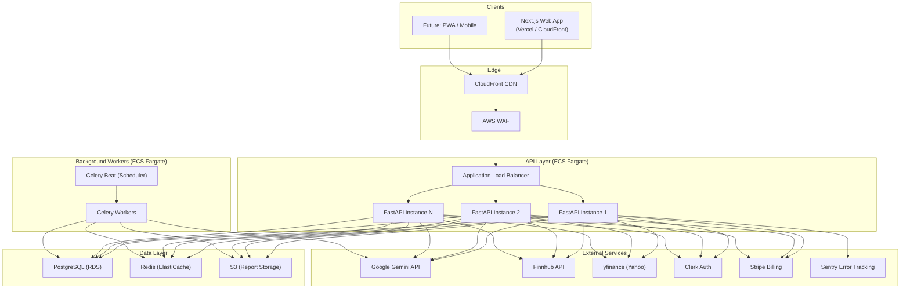
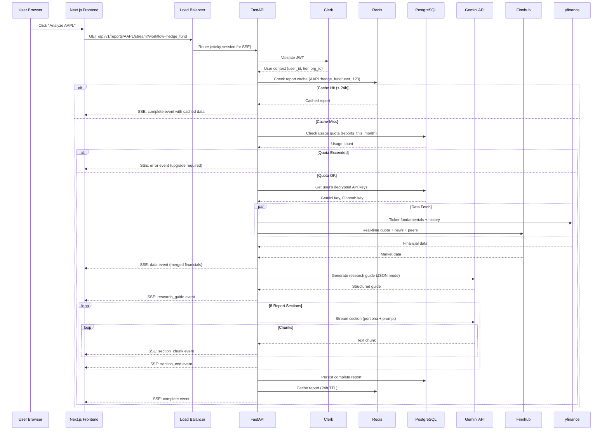
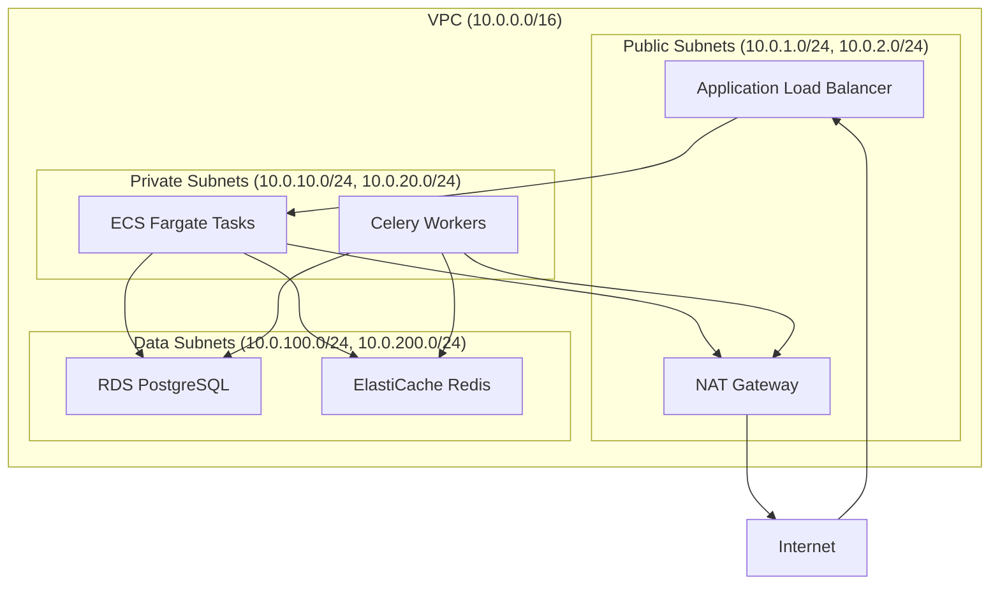
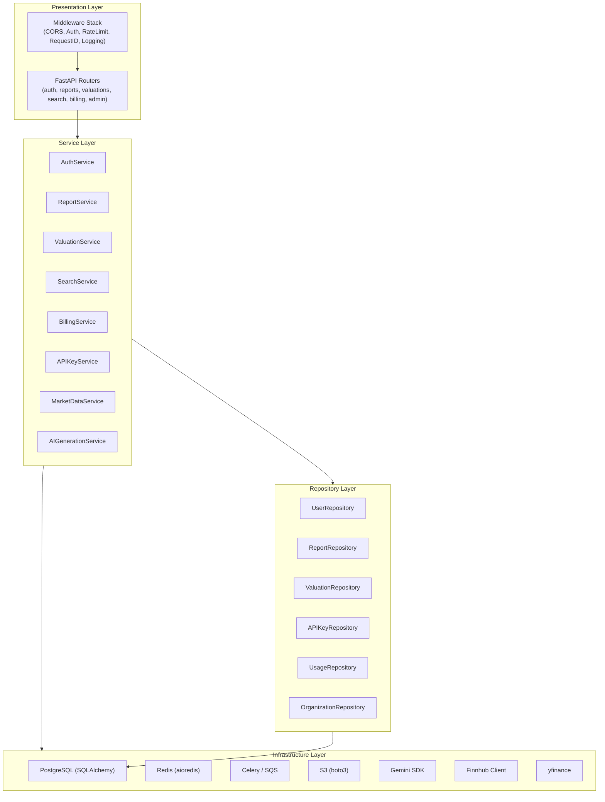
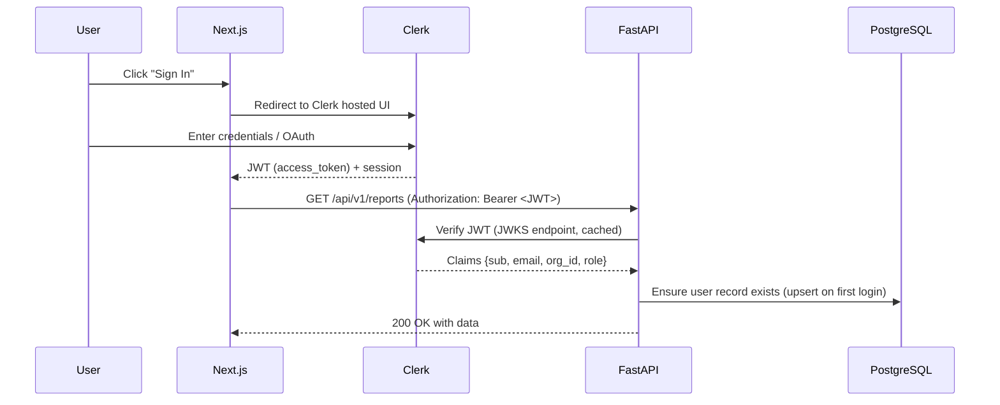
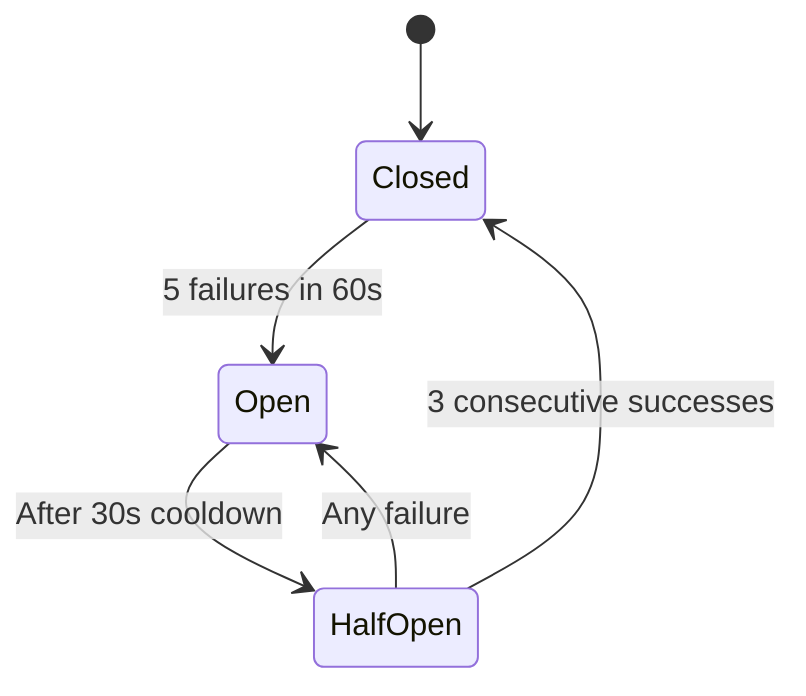
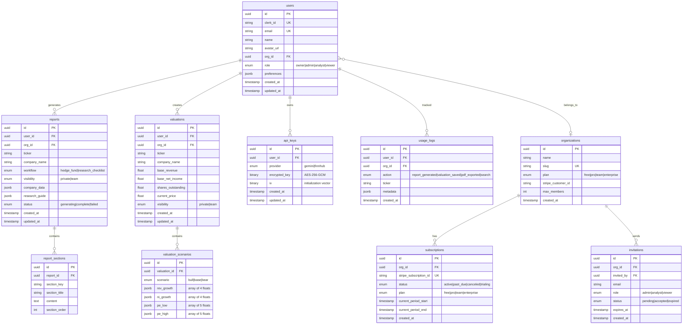
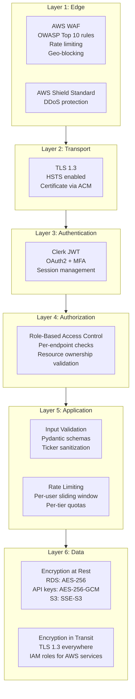
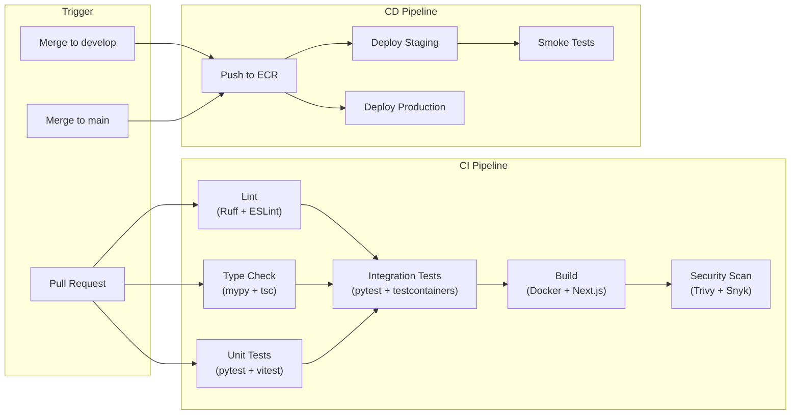

# ApexAlpha AI — SaaS Architecture Document

> **Version**: 1.0.0 | **Date**: 2026-06-08 | **Status**: DRAFT — Pending Review  
> **Author**: Platform Architecture Team  
> **Audience**: Engineering, Product, DevOps, Security

---

## Table of Contents

1. [Executive Summary](#1-executive-summary)
2. [Current State Analysis](#2-current-state-analysis)
3. [Design Principles](#3-design-principles)
4. [System Overview](#4-system-overview)
5. [Infrastructure Architecture](#5-infrastructure-architecture)
6. [Backend Architecture](#6-backend-architecture)
7. [Frontend Architecture](#7-frontend-architecture)
8. [Data Architecture](#8-data-architecture)
9. [Security Architecture](#9-security-architecture)
10. [Observability & Monitoring](#10-observability--monitoring)
11. [DevOps & CI/CD](#11-devops--cicd)
12. [Technology Stack Summary](#12-technology-stack-summary)
13. [Migration Strategy](#13-migration-strategy)
14. [Appendix](#14-appendix)

---

## 1. Executive Summary

ApexAlpha AI is an institutional-grade investment research platform that generates hedge-fund-quality memos, executes due diligence checklists, and provides multi-scenario stock valuation models. Today it operates as a **single-user, locally-run desktop tool** with no authentication, no database, no multi-tenancy, and API keys stored in a single shared global dictionary.

This document defines the **target-state architecture** to transform ApexAlpha AI into a **production-grade, multi-tenant SaaS platform** capable of serving thousands of concurrent users with enterprise-level security, reliability, and observability.

### Scope of Transformation

| Dimension | Current State | Target State |
|---|---|---|
| **Users** | Single user, no auth | Multi-tenant with RBAC |
| **Data Storage** | In-memory + localStorage | PostgreSQL + Redis + S3 |
| **API Keys** | Global shared dict | Per-user, AES-256 encrypted |
| **Infrastructure** | `python main.py` on localhost | Containerized on AWS ECS |
| **Frontend** | Vanilla HTML/CSS/JS (2 pages) | Next.js SPA with component library |
| **Billing** | None | Stripe with tiered subscriptions |
| **Observability** | `print()` statements | Structured logging, metrics, tracing |
| **CI/CD** | None | GitHub Actions → ECR → ECS |
| **Security** | CORS `*`, no HTTPS | WAF, TLS 1.3, SOC 2 readiness |

---

## 2. Current State Analysis

### 2.1 Architecture Audit

The current system consists of **10 files** (~187KB total) split across two directories:

```
hedge-fund-analysis/
├── backend/                          # FastAPI server
│   ├── main.py          (390 lines)  # 6 endpoints + catch-all, CORS *, global _session_keys
│   ├── data_fetcher.py  (562 lines)  # yfinance + Finnhub, 8 functions, sync blocking
│   ├── report_generator.py (572 lines) # Gemini 2.5 Flash, 17 prompts, 2 personas
│   └── requirements.txt (10 lines)   # 9 dependencies, no lock file
│
└── frontend/                         # Vanilla client
    ├── index.html       (202 lines)  # Research hub: navbar, sidebar, modal, report viewer
    ├── valuation.html   (160 lines)  # Calculator: 3 scenario blocks (Bull/Base/Bear)
    ├── style.css        (319 lines)  # Dark glassmorphism design system, 6 breakpoints
    ├── valuation.css    (695 lines)  # Scenario-specific styling, gold gradients
    ├── app.js           (807 lines)  # SSE client, report cache (localStorage), search
    └── valuation.js     (661 lines)  # 5yr projection engine, reactive inputs, localStorage
```

### 2.2 Critical Blockers for SaaS

| # | Issue | Severity | Impact |
|---|---|---|---|
| 1 | **Global shared `_session_keys` dict** | 🔴 Critical | Any user's POST overwrites all users' API keys |
| 2 | **No authentication** | 🔴 Critical | Zero access control on any endpoint |
| 3 | **No database** | 🔴 Critical | All state lost on server restart |
| 4 | **CORS `allow_origins=["*"]`** | 🔴 Critical | Any origin can call the API with credentials |
| 5 | **`genai.configure()` is global** | 🟡 High | Race condition: concurrent requests clobber each other's Gemini config |
| 6 | **No rate limiting** | 🟡 High | Single user can exhaust Gemini/Finnhub quotas |
| 7 | **Sync blocking in `/api/quote`** | 🟡 High | Blocks the event loop for all concurrent users |
| 8 | **No report persistence** | 🟡 Medium | Reports exist only in SSE stream + browser localStorage |
| 9 | **Duplicated frontend code** | 🟡 Medium | Search, toast, API_BASE logic copy-pasted across app.js & valuation.js |
| 10 | **Simulated price data** | 🟡 Medium | Fake sine-wave prices generated without disclosure |
| 11 | **No tests, CI/CD, Docker** | 🟡 Medium | Zero automated quality gates |
| 12 | **Hardcoded model** | 🟢 Low | `gemini-2.5-flash` baked into report_generator.py |

---

## 3. Design Principles

| Principle | Description |
|---|---|
| **Multi-Tenant by Default** | Every data path isolates by `user_id` or `org_id`. No shared global state. |
| **Security-First** | Encryption at rest + in transit. RBAC on every endpoint. SOC 2 readiness from day one. |
| **API-First** | Backend exposes a versioned REST API (`/api/v1/`). Frontend is a pure API consumer. |
| **Event-Driven Streaming** | Report generation remains SSE-streamed. Background jobs for heavy processing. |
| **Progressive Enhancement** | Free tier works with BYOK (bring-your-own-key). Paid tiers add managed AI, persistence, collaboration. |
| **Observable by Default** | Structured logs, request tracing, and metrics on every service boundary. |
| **Infrastructure as Code** | All cloud resources defined in Terraform. No manual console changes. |
| **Fail Gracefully** | Circuit breakers on external APIs. Retry with exponential backoff. Graceful SSE error recovery. |

---

## 4. System Overview

### 4.1 High-Level Architecture



### 4.2 Request Flow — Report Generation (SSE)



---

## 5. Infrastructure Architecture

### 5.1 AWS Service Map

| Layer | Service | Purpose | Configuration |
|---|---|---|---|
| **Edge** | CloudFront | CDN for frontend assets, API caching | Custom domain, TLS 1.3 |
| **Edge** | AWS WAF | Web application firewall | Rate limiting rules, SQL injection protection |
| **Edge** | Route 53 | DNS management | `apexalpha.ai`, `api.apexalpha.ai` |
| **Compute** | ECS Fargate | Container orchestration | Auto-scaling 2-10 tasks |
| **Compute** | ECR | Container registry | Private, image scanning enabled |
| **Database** | RDS PostgreSQL 16 | Primary data store | Multi-AZ, `db.t3.medium` start |
| **Cache** | ElastiCache Redis 7 | Session cache, quote cache, rate limiting | `cache.t3.micro` start, cluster mode |
| **Storage** | S3 | Report PDFs, exports, assets | Versioned, lifecycle policies |
| **Queue** | SQS | Background job queue (Celery broker alternative) | Standard queue, DLQ configured |
| **Secrets** | Secrets Manager | Database creds, encryption keys, API keys | Auto-rotation enabled |
| **Monitoring** | CloudWatch | Logs, metrics, alarms | Log groups per service |
| **Auth** | Clerk (External) | Authentication provider | JWT verification, OAuth flows |
| **Billing** | Stripe (External) | Subscription management | Webhooks via API Gateway |

### 5.2 Network Architecture



- **Public subnets**: ALB and NAT Gateway only. No application containers exposed directly.
- **Private subnets**: All ECS tasks and workers. Egress via NAT for external API calls.
- **Data subnets**: Database and cache instances. No internet access. Security groups restrict to private subnet CIDRs only.
- **Multi-AZ**: All layers deployed across 2 availability zones minimum.

### 5.3 Environment Strategy

| Environment | Purpose | Infrastructure | Data |
|---|---|---|---|
| **Local** | Developer machines | Docker Compose (API + PG + Redis) | Seeded test data |
| **Dev** | Integration testing | Reduced ECS (1 task), shared RDS | Synthetic data |
| **Staging** | Pre-production validation | Production-mirror (scaled down) | Anonymized prod snapshot |
| **Production** | Live users | Full HA setup, Multi-AZ | Real user data |

---

## 6. Backend Architecture

### 6.1 Layered Architecture



### 6.2 Project Structure

```
apps/api/
├── app/
│   ├── __init__.py
│   ├── main.py                    # FastAPI app factory, middleware registration
│   ├── config.py                  # Pydantic Settings (env-driven)
│   ├── dependencies.py            # Dependency injection (get_db, get_current_user, etc.)
│   │
│   ├── routers/                   # Presentation layer
│   │   ├── __init__.py
│   │   ├── auth.py                # POST /auth/login, /auth/register, /auth/callback
│   │   ├── reports.py             # GET/POST/DELETE /reports, GET /reports/{id}/stream (SSE)
│   │   ├── valuations.py          # CRUD /valuations, /valuations/{id}/scenarios
│   │   ├── search.py              # GET /search?q=
│   │   ├── quotes.py              # GET /quotes/{ticker}, /quotes/{ticker}/valuation
│   │   ├── billing.py             # GET /billing/plans, POST /billing/checkout, webhooks
│   │   ├── keys.py                # GET/PUT /keys (per-user API key management)
│   │   ├── admin.py               # Admin-only endpoints
│   │   └── health.py              # GET /health, /ready
│   │
│   ├── services/                  # Business logic
│   │   ├── __init__.py
│   │   ├── report_service.py      # Orchestrates data fetch → AI generation → persistence
│   │   ├── valuation_service.py   # Projection calculations, scenario CRUD
│   │   ├── market_data_service.py # Unified yfinance + Finnhub with circuit breakers
│   │   ├── ai_service.py          # Gemini client pool, per-request config (NOT global)
│   │   ├── billing_service.py     # Stripe integration, usage metering
│   │   ├── key_service.py         # AES-256 encrypt/decrypt user API keys
│   │   └── search_service.py      # Ticker search with caching
│   │
│   ├── repositories/              # Data access
│   │   ├── __init__.py
│   │   ├── user_repo.py
│   │   ├── report_repo.py
│   │   ├── valuation_repo.py
│   │   ├── api_key_repo.py
│   │   └── usage_repo.py
│   │
│   ├── models/                    # SQLAlchemy ORM models
│   │   ├── __init__.py
│   │   ├── user.py
│   │   ├── report.py
│   │   ├── valuation.py
│   │   ├── api_key.py
│   │   ├── organization.py
│   │   ├── subscription.py
│   │   └── usage_log.py
│   │
│   ├── schemas/                   # Pydantic request/response schemas
│   │   ├── __init__.py
│   │   ├── auth.py
│   │   ├── report.py
│   │   ├── valuation.py
│   │   ├── billing.py
│   │   └── common.py              # Pagination, error responses
│   │
│   ├── middleware/
│   │   ├── __init__.py
│   │   ├── auth_middleware.py      # JWT validation via Clerk
│   │   ├── rate_limit.py          # Redis-backed sliding window
│   │   ├── request_id.py          # X-Request-ID propagation
│   │   └── cors.py                # Environment-specific CORS
│   │
│   ├── core/
│   │   ├── __init__.py
│   │   ├── encryption.py          # AES-256-GCM for API keys at rest
│   │   ├── exceptions.py          # Custom exception hierarchy
│   │   ├── circuit_breaker.py     # External API circuit breaker
│   │   └── prompts/               # Gemini prompt templates (moved from report_generator.py)
│   │       ├── hedge_fund.py
│   │       └── research_checklist.py
│   │
│   └── workers/                   # Celery tasks
│       ├── __init__.py
│       ├── celery_app.py
│       └── tasks.py               # report_generation_task, data_prefetch_task
│
├── alembic/                       # Database migrations
│   ├── versions/
│   └── env.py
├── tests/
│   ├── unit/
│   ├── integration/
│   └── conftest.py
├── Dockerfile
├── pyproject.toml
└── alembic.ini
```

### 6.3 Authentication & Authorization

**Provider**: [Clerk](https://clerk.com) — managed auth with JWT, OAuth (Google, GitHub, Microsoft), MFA, and user management.

**Flow**:



**Authorization Model**:

| Role | Scope | Permissions |
|---|---|---|
| `owner` | Organization | Full CRUD, billing, member management, delete org |
| `admin` | Organization | CRUD reports/valuations, invite members, manage keys |
| `analyst` | Organization | CRUD own reports/valuations, view shared reports |
| `viewer` | Organization | Read-only access to shared reports |

**Middleware implementation** (pseudocode):
```python
# dependencies.py
async def get_current_user(request: Request, db: AsyncSession) -> User:
    token = request.headers.get("Authorization", "").replace("Bearer ", "")
    claims = clerk_client.verify_token(token)  # Cached JWKS
    user = await user_repo.get_or_create(db, clerk_id=claims["sub"], email=claims["email"])
    return user

async def require_role(min_role: str):
    def checker(user: User = Depends(get_current_user)):
        if user.role_rank < ROLE_RANKS[min_role]:
            raise HTTPException(403, "Insufficient permissions")
        return user
    return checker
```

### 6.4 Multi-Tenant Data Isolation

**Strategy**: Row-Level Isolation with `user_id` foreign keys on all tenant-scoped tables. Organization-level sharing via `org_id`.

```python
# Every query automatically scoped
class ReportRepository:
    async def list_reports(self, db: AsyncSession, user_id: UUID, org_id: UUID | None):
        query = select(Report).where(
            or_(
                Report.user_id == user_id,                    # Own reports
                and_(Report.org_id == org_id,                 # Org shared reports
                     Report.visibility == "team")
            )
        ).order_by(Report.created_at.desc())
        return await db.execute(query)
```

### 6.5 API Design

**Base URL**: `https://api.apexalpha.ai/api/v1`

| Method | Endpoint | Auth | Tier | Description |
|---|---|---|---|---|
| `GET` | `/health` | No | — | Health check |
| `GET` | `/ready` | No | — | Readiness probe (DB + Redis) |
| **Auth** | | | | |
| `POST` | `/auth/webhook` | Clerk SVIX | — | Clerk webhook (user.created, user.updated) |
| **Search** | | | | |
| `GET` | `/search?q={query}` | Yes | All | Ticker search (cached 1h) |
| **Quotes** | | | | |
| `GET` | `/quotes/{ticker}` | Yes | All | Company data + real-time quote |
| `GET` | `/quotes/{ticker}/valuation` | Yes | All | Valuation-specific data |
| **Reports** | | | | |
| `GET` | `/reports` | Yes | All | List user's reports (paginated) |
| `GET` | `/reports/{id}` | Yes | All | Get saved report |
| `GET` | `/reports/{ticker}/stream` | Yes | All | SSE: generate new report |
| `DELETE` | `/reports/{id}` | Yes | All | Delete report |
| **Valuations** | | | | |
| `GET` | `/valuations` | Yes | All | List saved valuations |
| `GET` | `/valuations/{id}` | Yes | All | Get valuation with scenarios |
| `POST` | `/valuations` | Yes | Pro+ | Create valuation |
| `PUT` | `/valuations/{id}/scenarios/{sc}` | Yes | Pro+ | Update scenario |
| `DELETE` | `/valuations/{id}` | Yes | Pro+ | Delete valuation |
| **API Keys** | | | | |
| `GET` | `/keys/status` | Yes | All | Check configured keys |
| `PUT` | `/keys` | Yes | All | Set/update encrypted keys |
| **Billing** | | | | |
| `GET` | `/billing/plans` | Yes | All | Available plans |
| `POST` | `/billing/checkout` | Yes | Free | Create Stripe checkout session |
| `POST` | `/billing/portal` | Yes | Paid | Stripe customer portal |
| `POST` | `/billing/webhook` | Stripe Sig | — | Stripe webhook handler |
| **Admin** | | | | |
| `GET` | `/admin/usage` | Yes | Admin | Usage analytics dashboard |

**Pagination**: Cursor-based for lists.
```json
{
  "data": [...],
  "pagination": {
    "next_cursor": "eyJpZCI6...",
    "has_more": true,
    "total_count": 47
  }
}
```

**Error Response Format**:
```json
{
  "error": {
    "code": "QUOTA_EXCEEDED",
    "message": "You have used 5/5 reports this month. Upgrade to Pro for unlimited.",
    "details": { "current_usage": 5, "limit": 5, "resets_at": "2026-07-01T00:00:00Z" }
  }
}
```

### 6.6 SSE Streaming Architecture

The current SSE implementation is preserved but hardened for multi-tenant:

**Key changes from current:**
1. **Per-request Gemini client** — no more global `genai.configure()`. Each SSE stream instantiates its own `GenerativeModel` with the user's decrypted API key.
2. **Sticky sessions** — ALB configured with cookie-based stickiness for SSE connections.
3. **Heartbeat** — Send `:keepalive\n\n` every 15s to prevent proxy timeouts.
4. **Resume token** — Each `section_end` event includes a resume token. If connection drops, client can reconnect with `Last-Event-ID` to skip completed sections.
5. **Timeout** — Maximum 5-minute SSE connection. 8 sections × ~30s each ≈ 4 minutes typical.

```python
# ai_service.py — Per-request, no global state
class AIGenerationService:
    def create_model(self, api_key: str, persona: str) -> GenerativeModel:
        # Each call creates an isolated client — NO global genai.configure()
        client = genai.Client(api_key=api_key)
        return client.GenerativeModel(
            model_name="gemini-2.5-flash",
            system_instruction=persona,
        )
    
    async def stream_section(self, model, prompt: str):
        response = await asyncio.to_thread(
            model.generate_content, prompt, stream=True
        )
        for chunk in response:
            if chunk.text:
                yield chunk.text
            await asyncio.sleep(0)  # Yield control
```

### 6.7 Background Job Processing

**Stack**: Celery 5.x with Redis broker (or SQS for higher durability).

**Job Types**:

| Job | Trigger | Priority | Timeout |
|---|---|---|---|
| `generate_report_async` | User request (for queued mode on Free tier) | Medium | 5 min |
| `export_pdf` | User clicks "Export PDF" | Low | 2 min |
| `prefetch_data` | Cron (popular tickers, every 15m) | Low | 1 min |
| `usage_aggregation` | Cron (daily at midnight UTC) | Low | 5 min |
| `cleanup_expired_cache` | Cron (daily at 3am UTC) | Low | 10 min |

### 6.8 Rate Limiting

**Implementation**: Redis sliding window counter per `(user_id, endpoint_group)`.

| Tier | Reports/month | Valuations/month | Search/min | Quote/min |
|---|---|---|---|---|
| **Free** | 5 | 10 | 30 | 60 |
| **Pro** | Unlimited | Unlimited | 60 | 120 |
| **Team** | Unlimited | Unlimited | 120 | 240 |
| **Enterprise** | Unlimited | Unlimited | 300 | 600 |

**Burst protection**: Global rate limit of 100 req/s per IP regardless of tier.

### 6.9 External Service Integration

**Circuit Breaker Pattern**:



| Service | Circuit Breaker | Timeout | Fallback |
|---|---|---|---|
| **Gemini** | 5 failures / 60s | 30s per chunk | Error event in SSE stream |
| **Finnhub** | 3 failures / 60s | 10s | yfinance-only mode |
| **yfinance** | 3 failures / 60s | 15s | Finnhub-only mode (via `_build_finnhub_financials`) |

### 6.10 Caching Strategy

| Data | Store | TTL | Key Pattern | Invalidation |
|---|---|---|---|---|
| **Search results** | Redis | 1 hour | `search:{query_hash}` | TTL expiry |
| **Quote data** | Redis | 5 min | `quote:{ticker}` | TTL expiry |
| **Valuation quote** | Redis | 10 min | `valquote:{ticker}` | TTL expiry |
| **Generated report** | Redis + DB | 24h (Redis), permanent (DB) | `report:{ticker}:{workflow}:{user_id}` | Manual refresh |
| **Research guide** | Redis | 24h | `guide:{ticker}:{workflow}` | TTL expiry |
| **Clerk JWKS** | In-memory | 1 hour | N/A | TTL expiry |
| **User subscription tier** | Redis | 5 min | `tier:{user_id}` | Stripe webhook invalidation |

---

## 7. Frontend Architecture

### 7.1 Migration: Vanilla JS → Next.js

**Framework**: Next.js 15 (App Router) with TypeScript.  
**Rationale**: SSR for SEO (landing/marketing pages), client-side rendering for app, built-in routing, excellent Clerk integration, Vercel deployment option.

### 7.2 Project Structure

```
apps/web/
├── src/
│   ├── app/                           # Next.js App Router
│   │   ├── (marketing)/               # Public pages (SSR)
│   │   │   ├── page.tsx               # Landing page
│   │   │   ├── pricing/page.tsx
│   │   │   └── layout.tsx
│   │   ├── (auth)/                    # Auth pages
│   │   │   ├── sign-in/[[...sign-in]]/page.tsx
│   │   │   └── sign-up/[[...sign-up]]/page.tsx
│   │   ├── (dashboard)/               # Protected app (CSR)
│   │   │   ├── layout.tsx             # Auth guard + sidebar nav
│   │   │   ├── page.tsx               # Dashboard home
│   │   │   ├── research/page.tsx      # Report generation (was index.html)
│   │   │   ├── valuation/page.tsx     # Valuation calc (was valuation.html)
│   │   │   ├── reports/
│   │   │   │   ├── page.tsx           # Saved reports list
│   │   │   │   └── [id]/page.tsx      # Report viewer
│   │   │   ├── settings/
│   │   │   │   ├── page.tsx           # Account settings
│   │   │   │   ├── keys/page.tsx      # API key management
│   │   │   │   └── billing/page.tsx   # Subscription management
│   │   │   └── team/                  # Team management (Team tier+)
│   │   │       └── page.tsx
│   │   └── api/                       # Next.js API routes (minimal — proxy if needed)
│   │
│   ├── components/
│   │   ├── ui/                        # Base UI components
│   │   │   ├── Button.tsx
│   │   │   ├── Input.tsx
│   │   │   ├── Modal.tsx
│   │   │   ├── Toast.tsx
│   │   │   ├── Card.tsx
│   │   │   ├── Badge.tsx
│   │   │   ├── Skeleton.tsx
│   │   │   └── ProgressBar.tsx
│   │   ├── layout/
│   │   │   ├── Navbar.tsx             # Migrated from index.html navbar
│   │   │   ├── Sidebar.tsx            # Research guide sidebar
│   │   │   └── AppShell.tsx
│   │   ├── research/
│   │   │   ├── SearchBar.tsx          # Unified search (was duplicated)
│   │   │   ├── ReportViewer.tsx       # SSE stream consumer
│   │   │   ├── SectionCard.tsx        # Individual report section
│   │   │   ├── CompanyHeader.tsx      # Ticker header with sparkline
│   │   │   ├── FinancialMetrics.tsx   # 8-metric grid
│   │   │   ├── NewsFeed.tsx           # News strip
│   │   │   ├── ResearchGuide.tsx      # Sidebar content
│   │   │   └── ModeSelector.tsx       # HF / RC mode toggle
│   │   ├── valuation/
│   │   │   ├── StockHeader.tsx        # Editable price/shares
│   │   │   ├── ScenarioBlock.tsx      # Bull/Base/Bear block
│   │   │   ├── ProjectionTable.tsx    # Reactive calculation table
│   │   │   └── ScenarioControls.tsx   # Save/Load buttons
│   │   └── billing/
│   │       ├── PricingCards.tsx
│   │       └── UsageMeter.tsx
│   │
│   ├── hooks/
│   │   ├── useSSE.ts                  # SSE connection manager with reconnect
│   │   ├── useSearch.ts               # Debounced search with cache
│   │   ├── useProjections.ts          # Valuation calculations (from valuation.js)
│   │   └── useToast.ts                # Toast notification system
│   │
│   ├── stores/                        # Zustand state management
│   │   ├── reportStore.ts             # Report generation state
│   │   ├── valuationStore.ts          # Valuation scenarios state
│   │   └── authStore.ts               # User/subscription state
│   │
│   ├── lib/
│   │   ├── api.ts                     # API client (fetch wrapper with auth)
│   │   ├── formatters.ts              # fmt$, fmtShort, fmtPct, etc. (from valuation.js)
│   │   └── constants.ts               # Section orders, defaults, etc.
│   │
│   └── styles/
│       ├── globals.css                # CSS custom properties (migrated from style.css)
│       ├── research.module.css
│       └── valuation.module.css
│
├── public/
├── next.config.ts
├── tsconfig.json
├── package.json
└── Dockerfile
```

### 7.3 State Management

**Library**: Zustand — lightweight, no boilerplate, excellent TypeScript support.

```typescript
// stores/reportStore.ts
interface ReportState {
  currentTicker: string | null;
  isGenerating: boolean;
  workflow: 'hedge_fund' | 'research_checklist';
  sections: Record<string, { title: string; content: string; status: 'pending' | 'loading' | 'done' }>;
  companyData: CompanyData | null;
  researchGuide: ResearchGuide | null;
  // Actions
  startReport: (ticker: string) => void;
  setWorkflow: (wf: 'hedge_fund' | 'research_checklist') => void;
  appendSectionChunk: (key: string, text: string) => void;
  finalizeSection: (key: string) => void;
  reset: () => void;
}
```

### 7.4 SSE in React

```typescript
// hooks/useSSE.ts
export function useSSE(url: string | null, handlers: SSEHandlers) {
  const sourceRef = useRef<EventSource | null>(null);
  
  useEffect(() => {
    if (!url) return;
    const source = new EventSource(url, { withCredentials: true });
    sourceRef.current = source;
    
    // Heartbeat timeout — reconnect if no event for 20s
    let heartbeat = setTimeout(reconnect, 20000);
    
    for (const [event, handler] of Object.entries(handlers)) {
      source.addEventListener(event, (e) => {
        clearTimeout(heartbeat);
        heartbeat = setTimeout(reconnect, 20000);
        handler(JSON.parse(e.data));
      });
    }
    
    source.onerror = () => { /* exponential backoff reconnect */ };
    return () => { source.close(); clearTimeout(heartbeat); };
  }, [url]);
}
```

### 7.5 Design System Migration

The existing CSS custom properties (`--bg`, `--accent`, `--card`, `--border`, etc.) are migrated directly into `globals.css`. The glassmorphism dark theme is preserved as the default, with a future light mode planned via CSS custom property overrides.

**Typography**: Inter (300-700) for UI, JetBrains Mono (400, 500) for data — both loaded via `next/font`.

---

## 8. Data Architecture

### 8.1 Database Schema



### 8.2 Indexes

```sql
-- Performance-critical indexes
CREATE INDEX idx_reports_user_id ON reports(user_id, created_at DESC);
CREATE INDEX idx_reports_org_id ON reports(org_id, created_at DESC) WHERE org_id IS NOT NULL;
CREATE INDEX idx_reports_ticker ON reports(ticker, workflow);
CREATE INDEX idx_valuations_user_id ON valuations(user_id, created_at DESC);
CREATE INDEX idx_usage_logs_user_month ON usage_logs(user_id, created_at) 
    WHERE created_at >= date_trunc('month', now());
CREATE INDEX idx_api_keys_user ON api_keys(user_id, provider);
CREATE UNIQUE INDEX idx_users_clerk_id ON users(clerk_id);
```

### 8.3 Migration Strategy (localStorage → Database)

For existing local users transitioning to the SaaS:

1. **First login**: User signs up, gets a fresh account.
2. **Import prompt**: Frontend detects `apexalpha_report_*` and `apexalpha_val_*` keys in localStorage.
3. **One-click import**: POST `/api/v1/import` with localStorage dump → server parses and creates DB records.
4. **Cleanup**: After successful import, clear localStorage keys.

### 8.4 Backup & Disaster Recovery

| Component | Strategy | RPO | RTO |
|---|---|---|---|
| **PostgreSQL** | RDS automated backups (daily) + continuous WAL archiving | 5 min | 30 min |
| **Redis** | ElastiCache snapshots (daily). Treat as ephemeral — loss acceptable. | 24h | 5 min |
| **S3** | Cross-region replication, versioning enabled | 0 (real-time) | Minutes |
| **Secrets** | AWS Secrets Manager (replicated, versioned) | 0 | Minutes |

---

## 9. Security Architecture

### 9.1 Defense in Depth



### 9.2 API Key Encryption

User-provided API keys (Gemini, Finnhub) are encrypted at rest using AES-256-GCM:

```python
# core/encryption.py
from cryptography.hazmat.primitives.ciphers.aead import AESGCM
import os

class KeyEncryptor:
    def __init__(self, master_key: bytes):  # 32 bytes from AWS Secrets Manager
        self._aesgcm = AESGCM(master_key)
    
    def encrypt(self, plaintext: str) -> tuple[bytes, bytes]:
        iv = os.urandom(12)  # 96-bit nonce
        ciphertext = self._aesgcm.encrypt(iv, plaintext.encode(), None)
        return ciphertext, iv
    
    def decrypt(self, ciphertext: bytes, iv: bytes) -> str:
        return self._aesgcm.decrypt(iv, ciphertext, None).decode()
```

- **Master key** stored in AWS Secrets Manager, rotated quarterly.
- Each API key stored as `(ciphertext, iv)` pair in the `api_keys` table.
- Decryption happens only at the moment of external API call — key is never held in memory longer than the request lifetime.

### 9.3 CORS Policy

```python
# Environment-specific CORS (replaces current allow_origins=["*"])
CORS_ORIGINS = {
    "production": ["https://apexalpha.ai", "https://www.apexalpha.ai"],
    "staging": ["https://staging.apexalpha.ai"],
    "development": ["http://localhost:3000"],
}
```

### 9.4 Input Validation

```python
# schemas/report.py
class ReportStreamRequest(BaseModel):
    ticker: str = Field(..., min_length=1, max_length=10, pattern=r'^[A-Z0-9.\-]+$')
    workflow: Literal["hedge_fund", "research_checklist"]
```

All ticker inputs validated against `^[A-Z0-9.\-]+$` regex. No raw SQL. No user input in prompt templates without sanitization.

### 9.5 SOC 2 Readiness Checklist

| Control | Implementation |
|---|---|
| Access Control | Clerk RBAC, principle of least privilege |
| Encryption | AES-256 at rest, TLS 1.3 in transit |
| Logging | All access logged with user ID, IP, action |
| Change Management | Git PR reviews, CI/CD, no manual deploys |
| Incident Response | PagerDuty integration, runbook documentation |
| Data Retention | Configurable retention policies, right to deletion |
| Vulnerability Management | Dependabot, container scanning, OWASP WAF rules |

---

## 10. Observability & Monitoring

### 10.1 Logging

**Format**: Structured JSON to CloudWatch Logs.

```json
{
  "timestamp": "2026-06-08T12:00:00Z",
  "level": "INFO",
  "service": "apexalpha-api",
  "request_id": "req_abc123",
  "user_id": "usr_xyz789",
  "event": "report.generation.started",
  "ticker": "AAPL",
  "workflow": "hedge_fund",
  "duration_ms": null,
  "trace_id": "trace_def456"
}
```

**Library**: `structlog` for Python, configured with JSON renderer.

### 10.2 Metrics

| Metric | Type | Alert Threshold |
|---|---|---|
| `http_requests_total` | Counter | N/A |
| `http_request_duration_seconds` | Histogram | p99 > 5s |
| `sse_connections_active` | Gauge | > 500 |
| `report_generation_duration_seconds` | Histogram | p95 > 120s |
| `gemini_api_errors_total` | Counter | > 10/min |
| `finnhub_api_errors_total` | Counter | > 5/min |
| `active_subscriptions` | Gauge | N/A (business metric) |
| `reports_generated_total` | Counter | N/A (business metric) |
| `cache_hit_rate` | Gauge | < 30% |

### 10.3 Error Tracking

**Tool**: Sentry with source maps for frontend, Python integration for backend.

- Captures unhandled exceptions with full context (user, request, breadcrumbs).
- SSE errors specifically tagged for separate dashboard.
- Performance monitoring for transaction tracing.

### 10.4 Health Checks

```python
@router.get("/health")
async def health():
    return {"status": "ok", "version": settings.APP_VERSION}

@router.get("/ready")
async def readiness(db: AsyncSession = Depends(get_db), redis = Depends(get_redis)):
    db_ok = await db.execute(text("SELECT 1"))
    redis_ok = await redis.ping()
    if not (db_ok and redis_ok):
        raise HTTPException(503, "Not ready")
    return {"status": "ready", "db": "ok", "redis": "ok"}
```

---

## 11. DevOps & CI/CD

### 11.1 Git Workflow

- **`main`**: Production branch. Protected. Deploys to prod.
- **`develop`**: Integration branch. Deploys to staging.
- **`feature/*`**: Feature branches from `develop`. PR required.
- **`hotfix/*`**: Urgent fixes from `main`. PR to both `main` and `develop`.

### 11.2 CI/CD Pipeline



### 11.3 Docker Configuration

```dockerfile
# Backend Dockerfile (multi-stage)
FROM python:3.12-slim AS base
WORKDIR /app
COPY pyproject.toml uv.lock ./
RUN pip install uv && uv sync --frozen --no-dev

FROM python:3.12-slim AS runtime
WORKDIR /app
COPY --from=base /app/.venv /app/.venv
COPY apps/api/app ./app
COPY alembic ./alembic
COPY alembic.ini .
ENV PATH="/app/.venv/bin:$PATH"
EXPOSE 8000
HEALTHCHECK CMD curl -f http://localhost:8000/health || exit 1
CMD ["uvicorn", "app.main:app", "--host", "0.0.0.0", "--port", "8000", "--workers", "4"]
```

### 11.4 Infrastructure as Code

**Tool**: Terraform for all AWS resources.

```
infrastructure/
├── environments/
│   ├── dev/
│   │   └── terraform.tfvars
│   ├── staging/
│   │   └── terraform.tfvars
│   └── production/
│       └── terraform.tfvars
├── modules/
│   ├── networking/          # VPC, subnets, security groups
│   ├── ecs/                 # ECS cluster, services, task definitions
│   ├── rds/                 # PostgreSQL instance
│   ├── elasticache/         # Redis cluster
│   ├── s3/                  # Storage buckets
│   ├── cloudfront/          # CDN distribution
│   └── monitoring/          # CloudWatch dashboards, alarms
├── main.tf
├── variables.tf
└── outputs.tf
```

### 11.5 Deployment Strategy

**Method**: Rolling deployment via ECS with health checks.

| Setting | Value |
|---|---|
| Minimum healthy percent | 100% |
| Maximum percent | 200% |
| Health check grace period | 60s |
| Deregistration delay | 30s |

New tasks are started alongside old tasks. ALB health checks must pass before old tasks are drained. Automatic rollback if new tasks fail health checks within 5 minutes.

---

## 12. Technology Stack Summary

| Layer | Technology | Version | Rationale |
|---|---|---|---|
| **Frontend Framework** | Next.js | 15.x | SSR for marketing, CSR for app, excellent DX |
| **Frontend Language** | TypeScript | 5.x | Type safety, better IDE support |
| **State Management** | Zustand | 5.x | Lightweight, no boilerplate, great TS support |
| **Styling** | CSS Modules + CSS Variables | — | Preserve existing design system, no build overhead |
| **Backend Framework** | FastAPI | 0.115+ | Async, Pydantic, OpenAPI, existing codebase |
| **Backend Language** | Python | 3.12+ | Existing codebase, data science ecosystem |
| **ORM** | SQLAlchemy | 2.0+ | Async support, mature, flexible |
| **Migrations** | Alembic | 1.13+ | Standard for SQLAlchemy |
| **Database** | PostgreSQL | 16 | JSONB for flexible data, proven reliability |
| **Cache** | Redis | 7.x | Caching, rate limiting, sessions, pub/sub |
| **Task Queue** | Celery | 5.x | Background jobs, scheduled tasks |
| **Auth** | Clerk | — | Managed auth, JWT, OAuth, MFA, user mgmt |
| **Billing** | Stripe | — | Subscriptions, usage metering, webhooks |
| **AI** | Google Gemini | 2.5 Flash | Existing integration, fast streaming |
| **Market Data** | Finnhub + yfinance | — | Real-time + historical, dual-source resilience |
| **Container Runtime** | Docker | — | Consistent environments |
| **Orchestration** | AWS ECS Fargate | — | Serverless containers, no cluster management |
| **CDN** | CloudFront | — | Global edge caching |
| **CI/CD** | GitHub Actions | — | Native GitHub integration |
| **IaC** | Terraform | 1.9+ | Multi-cloud capable, mature ecosystem |
| **Monitoring** | CloudWatch + Sentry | — | AWS-native + best-in-class error tracking |
| **Logging** | structlog → CloudWatch | — | Structured JSON, centralized |

---

## 13. Migration Strategy

### Phase 1: Backend Hardening (Weeks 1-4)
1. Restructure into layered architecture
2. Add PostgreSQL + Alembic migrations
3. Replace global `_session_keys` with per-user encrypted storage
4. Replace global `genai.configure()` with per-request client instantiation
5. Wrap all sync data fetching in `run_in_executor`
6. Add Clerk JWT auth middleware
7. Add Redis caching layer
8. Dockerize

### Phase 2: Frontend Rewrite (Weeks 5-8)
1. Scaffold Next.js project
2. Migrate design system (CSS custom properties → globals.css)
3. Build component library from existing HTML/CSS
4. Implement Clerk auth UI
5. Build dashboard, report viewer, valuation calculator
6. Implement SSE with reconnection support

### Phase 3: SaaS Features (Weeks 9-12)
1. Stripe billing integration
2. Usage metering and tier enforcement
3. Report persistence and history
4. PDF export via background workers
5. Team/org features

### Phase 4: Production Hardening (Weeks 13-16)
1. Load testing (k6)
2. Security audit
3. Monitoring and alerting setup
4. Documentation
5. Beta launch

---

## 14. Appendix

### 14.1 Glossary

| Term | Definition |
|---|---|
| **BYOK** | Bring Your Own Key — users provide their own Gemini/Finnhub API keys |
| **HF Mode** | Hedge Fund workflow — 8-section investment memo |
| **RC Mode** | Research Checklist workflow — Jeremy's 8-step due diligence |
| **SSE** | Server-Sent Events — HTTP-based unidirectional streaming |
| **Trident** | Section within a report (e.g., "Core Thesis", "Financial Quality") |
| **Scenario** | Bull/Base/Bear case in valuation model |
| **ADR** | Architectural Decision Record |

### 14.2 ADR Log

| # | Decision | Date | Status |
|---|---|---|---|
| ADR-001 | Use Clerk over Auth0 for authentication | 2026-06-08 | Proposed |
| ADR-002 | Use ECS Fargate over EKS for container orchestration | 2026-06-08 | Proposed |
| ADR-003 | Use Zustand over Redux for frontend state | 2026-06-08 | Proposed |
| ADR-004 | Use PostgreSQL over DynamoDB for primary database | 2026-06-08 | Proposed |
| ADR-005 | Keep SSE over WebSocket for report streaming | 2026-06-08 | Proposed |
| ADR-006 | Use Next.js App Router over Pages Router | 2026-06-08 | Proposed |

### 14.3 Revision History

| Version | Date | Author | Changes |
|---|---|---|---|
| 1.0.0 | 2026-06-08 | Architecture Team | Initial draft |
