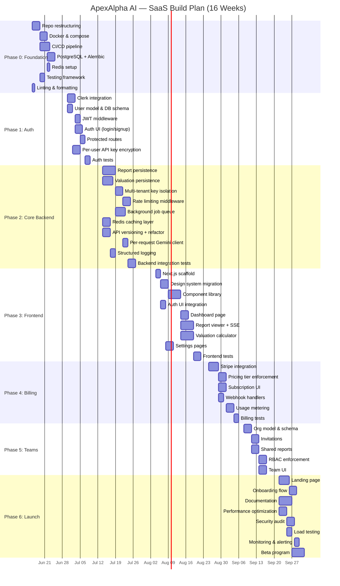
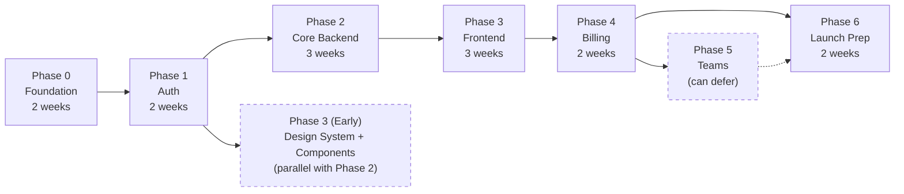

# ApexAlpha AI — SaaS Build Plan

> **Version**: 1.0.0 | **Date**: 2026-06-08 | **Status**: DRAFT — Pending Approval  
> **Timeline**: 16 weeks (4 months)  
> **Companion Docs**: [architecture.md](file:///C:/Users/abasy/.gemini/antigravity/brain/6b263141-3f2e-4b27-9b71-87472f1310b8/architecture.md) · [prd.md](file:///C:/Users/abasy/.gemini/antigravity/brain/6b263141-3f2e-4b27-9b71-87472f1310b8/prd.md)

---

## Table of Contents

1. [Timeline Overview](#1-timeline-overview)
2. [Team Composition](#2-team-composition)
3. [Phase 0 — Foundation & DevOps](#phase-0--foundation--devops-weeks-12)
4. [Phase 1 — Authentication & User Management](#phase-1--authentication--user-management-weeks-34)
5. [Phase 2 — Core SaaS Backend](#phase-2--core-saas-backend-weeks-57)
6. [Phase 3 — Frontend Modernization](#phase-3--frontend-modernization-weeks-810)
7. [Phase 4 — Billing & Subscriptions](#phase-4--billing--subscriptions-weeks-1112)
8. [Phase 5 — Team & Collaboration](#phase-5--team--collaboration-weeks-1314)
9. [Phase 6 — Polish & Launch Prep](#phase-6--polish--launch-prep-weeks-1516)
10. [Critical Path Analysis](#10-critical-path-analysis)
11. [Risk Register](#11-risk-register)
12. [Go/No-Go Launch Criteria](#12-gono-go-launch-criteria)

---

## 1. Timeline Overview



**Summary**:

| Phase | Weeks | Focus | Key Deliverable |
|---|---|---|---|
| 0 | 1-2 | Foundation & DevOps | Dockerized monorepo with CI/CD, DB, cache |
| 1 | 3-4 | Authentication | Users can sign up, log in, manage API keys |
| 2 | 5-7 | Core SaaS Backend | Reports/valuations persist, rate-limited, cached |
| 3 | 8-10 | Frontend Modernization | Next.js app with full feature parity + dashboard |
| 4 | 11-12 | Billing & Subscriptions | Stripe integration, tiered access enforcement |
| 5 | 13-14 | Team & Collaboration | Organization workspaces, shared content, RBAC |
| 6 | 15-16 | Polish & Launch Prep | Landing page, docs, security audit, beta launch |

---

## 2. Team Composition

### Recommended Team (Minimum Viable)

| Role | Count | Responsibilities | Phase Focus |
|---|---|---|---|
| **Tech Lead / Senior Backend** | 1 | Architecture, auth, database design, Gemini integration | All phases |
| **Senior Frontend** | 1 | Next.js migration, component library, SSE, design system | Phases 0, 3, 4, 6 |
| **Backend Developer** | 1 | API endpoints, caching, rate limiting, background jobs | Phases 1-2, 4-5 |
| **DevOps / Infrastructure** | 0.5 | Docker, CI/CD, Terraform, AWS setup, monitoring | Phases 0, 6 |
| **Product / Design** | 0.5 | PRD refinement, UX reviews, landing page, onboarding | Phases 3, 6 |

**Total**: 3-4 engineers + part-time DevOps and Product.

### Scaling Up (Faster Timeline)

Add 1 frontend developer to parallelize component library and page development in Phase 3, and 1 QA engineer for Phases 4-6 to increase test coverage. This reduces the timeline from 16 weeks to approximately 12-13 weeks.

---

## Phase 0 — Foundation & DevOps (Weeks 1-2)

> **Goal**: Transform the flat file structure into a production-ready monorepo with CI/CD, database, cache, and automated quality gates.

### Tasks

| # | Task | Est. | Owner | Depends On |
|---|---|---|---|---|
| 0.1 | **Repository restructuring** — Reorganize into monorepo: `apps/api/` (backend), `apps/web/` (frontend), `packages/shared/` (types, constants). Move current `backend/` files into `apps/api/app/`. Move `frontend/` into `apps/web/src/legacy/` (preserved for reference during migration). | 2d | Tech Lead | — |
| 0.2 | **Linting & formatting** — Configure Ruff (Python), ESLint + Prettier (JS/TS). Add pre-commit hooks. Create `.editorconfig`. | 1d | Backend Dev | — |
| 0.3 | **Docker containerization** — Multi-stage Dockerfile for API (Python 3.12-slim). `docker-compose.yml` with services: api, postgres, redis, celery-worker, celery-beat. Docker dev volumes for hot-reload. | 3d | DevOps | 0.1 |
| 0.4 | **CI/CD pipeline (GitHub Actions)** — Workflows: `ci.yml` (lint → type-check → test → build → scan on every PR), `cd-staging.yml` (deploy on merge to develop), `cd-prod.yml` (deploy on merge to main). | 4d | DevOps | 0.1 |
| 0.5 | **PostgreSQL setup** — Install SQLAlchemy 2.0 + asyncpg. Create `config.py` with Pydantic Settings. Set up Alembic with async support. Initial migration: create `users` table (minimal, just for Phase 1 readiness). | 3d | Tech Lead | 0.3 |
| 0.6 | **Redis setup** — Add `redis[hiredis]` dependency. Create Redis connection utility with health check. Verify connectivity in `docker-compose`. | 1d | Backend Dev | 0.3 |
| 0.7 | **Testing framework** — Set up pytest with `pytest-asyncio`, `httpx` (TestClient), `testcontainers-python` for integration tests. Create `conftest.py` with database fixtures. Set up test database seeding. Add first smoke test (health endpoint). | 2d | Tech Lead | 0.1 |
| 0.8 | **Environment configuration** — Create `.env.example` with all variables. Set up `python-dotenv` → Pydantic Settings migration. Document env vars. Add secrets to GitHub Actions. | 1d | Backend Dev | 0.1 |

### Deliverables
- [x] Monorepo structure with clear separation
- [x] `docker-compose up` starts full dev environment
- [x] CI runs on every PR (lint + test + build)
- [x] PostgreSQL accessible with Alembic migrations
- [x] Redis accessible for caching
- [x] At least 1 passing test

### Acceptance Criteria
1. `docker-compose up` brings up API + Postgres + Redis with zero manual configuration
2. `pytest` passes with ≥1 test against dockerized database
3. GitHub Actions CI workflow passes on a clean PR
4. Ruff reports zero lint errors on existing backend code
5. `.env.example` documents all required environment variables

### Risks & Mitigations
| Risk | Likelihood | Impact | Mitigation |
|---|---|---|---|
| Alembic async setup complexity | Medium | Medium | Use well-documented async Alembic template |
| Docker build times slow CI | Low | Medium | Multi-stage builds + layer caching in GHA |
| Existing code fails lint | High | Low | Run `ruff format` auto-fix, commit as single cleanup PR |

---

## Phase 1 — Authentication & User Management (Weeks 3-4)

> **Goal**: Users can sign up, log in (email + OAuth), and their API keys are stored per-user with AES-256 encryption. All report/valuation endpoints are protected.

### Tasks

| # | Task | Est. | Owner | Depends On |
|---|---|---|---|---|
| 1.1 | **Clerk account setup** — Create Clerk application. Configure OAuth providers (Google, GitHub). Set up JWT template with custom claims (`user_id`, `org_id`, `role`). Configure webhook endpoints. | 1d | Tech Lead | — |
| 1.2 | **User & Organization DB schema** — Create Alembic migrations for `users`, `organizations`, `invitations` tables. Add indexes. | 2d | Backend Dev | Phase 0 |
| 1.3 | **Clerk JWT middleware** — Create `auth_middleware.py` that validates JWT on every request to `/api/v1/*` (except `/health`, `/ready`, `/auth/webhook`). Cache JWKS keys in-memory (1h TTL). Extract `user_id`, `org_id`, `role` from claims. | 2d | Tech Lead | 1.1 |
| 1.4 | **User sync webhook** — POST `/api/v1/auth/webhook` handles Clerk `user.created`, `user.updated`, `user.deleted` events. Upserts user records in DB. Validates Svix webhook signatures. | 1d | Tech Lead | 1.2, 1.3 |
| 1.5 | **`get_current_user` dependency** — FastAPI dependency that extracts user from JWT, ensures DB record exists, and injects `User` model into route handlers. | 1d | Backend Dev | 1.3 |
| 1.6 | **Protected routes refactor** — Add `Depends(get_current_user)` to all existing endpoints (`/api/search`, `/api/quote`, `/api/report`, `/api/valuation-quote`). Rename endpoints with `/api/v1/` prefix. | 2d | Backend Dev | 1.5 |
| 1.7 | **Per-user API key encryption** — Implement `KeyEncryptor` (AES-256-GCM). Create `api_keys` table migration. Build `KeyService` with `set_key(user_id, provider, plaintext)` and `get_key(user_id, provider) → plaintext`. Master key from environment variable (later AWS Secrets Manager). | 3d | Tech Lead | 1.2 |
| 1.8 | **API key endpoints** — `GET /api/v1/keys/status` (returns configured status per provider), `PUT /api/v1/keys` (encrypts + stores per user). Replace global `_session_keys` dict usage throughout `main.py`. | 2d | Backend Dev | 1.7 |
| 1.9 | **Auth UI (temporary)** — Simple login/signup page served by FastAPI for testing. Will be replaced by Next.js in Phase 3. Uses Clerk's `<SignIn>` and `<SignUp>` components via JS SDK. | 2d | Frontend Dev | 1.1 |
| 1.10 | **Auth integration tests** — Test JWT validation, protected routes return 401 without token, user creation via webhook, API key encryption round-trip. | 2d | Tech Lead | 1.8 |

### Deliverables
- [x] Users can sign up and log in via Clerk (email + Google OAuth)
- [x] All API endpoints require valid JWT
- [x] API keys stored per-user with AES-256 encryption
- [x] User records synced from Clerk to PostgreSQL

### Acceptance Criteria
1. Unauthenticated requests to `/api/v1/reports/*` return `401 Unauthorized`
2. User A's API keys are not accessible by User B
3. API keys round-trip through encrypt → store → decrypt correctly
4. Clerk webhook creates user record in database within 5 seconds
5. OAuth login (Google) completes successfully in < 3 seconds

### Risks & Mitigations
| Risk | Likelihood | Impact | Mitigation |
|---|---|---|---|
| Clerk JWT verification adds latency | Medium | Medium | Cache JWKS keys, verify locally (no network call per request) |
| Master encryption key management | Medium | High | Start with env var, migrate to AWS Secrets Manager in Phase 6 |
| Webhook delivery failures | Low | Medium | Implement Clerk webhook retry + idempotent handler |

---

## Phase 2 — Core SaaS Backend (Weeks 5-7)

> **Goal**: Reports and valuations are persisted in PostgreSQL. Data fetching is properly async. Redis caching reduces external API calls. Rate limiting enforces per-tier quotas. Gemini configuration is per-request (no global race condition).

### Tasks

| # | Task | Est. | Owner | Depends On |
|---|---|---|---|---|
| 2.1 | **Report persistence model** — Create `reports` and `report_sections` tables. `ReportRepository` with `create`, `get_by_id`, `list_by_user`, `delete`. Reports store company data (JSONB), research guide (JSONB), and individual sections (text). Status enum: `generating`, `complete`, `failed`. | 3d | Backend Dev | Phase 1 |
| 2.2 | **Report generation refactor** — Modify SSE endpoint to: (a) create a `Report` record with status `generating` before streaming starts, (b) persist each section to `report_sections` as it completes, (c) update status to `complete` on finish or `failed` on error. | 2d | Tech Lead | 2.1 |
| 2.3 | **Report CRUD endpoints** — `GET /api/v1/reports` (paginated list), `GET /api/v1/reports/{id}` (full report with sections), `DELETE /api/v1/reports/{id}` (soft delete). Add visibility field (`private`, `team`). | 2d | Backend Dev | 2.1 |
| 2.4 | **Valuation persistence model** — Create `valuations` and `valuation_scenarios` tables. `ValuationRepository` with CRUD. Each valuation has 3 scenarios (bull/base/bear), each storing growth arrays and PE arrays as JSONB. | 3d | Backend Dev | Phase 1 |
| 2.5 | **Valuation CRUD endpoints** — `POST /api/v1/valuations`, `GET /api/v1/valuations`, `GET /api/v1/valuations/{id}`, `PUT /api/v1/valuations/{id}/scenarios/{sc}`, `DELETE /api/v1/valuations/{id}`. | 2d | Backend Dev | 2.4 |
| 2.6 | **Multi-tenant key isolation** — Refactor `data_fetcher.py` and `report_generator.py` to accept API keys as parameters (instead of reading from global dict). Thread user's decrypted keys through the entire call chain. | 2d | Tech Lead | Phase 1 |
| 2.7 | **Per-request Gemini client** — Replace `genai.configure(api_key=...)` (global) with per-request `genai.Client(api_key=...)` instantiation. Each SSE stream uses its own client. No shared global Gemini state. | 2d | Tech Lead | 2.6 |
| 2.8 | **Async data fetching fix** — Wrap ALL synchronous `yfinance` and `finnhub` calls in `asyncio.to_thread()` / `run_in_executor`. Currently `/api/quote/{ticker}` blocks the event loop. | 1d | Backend Dev | — |
| 2.9 | **Rate limiting middleware** — Redis sliding window counter. Key: `ratelimit:{user_id}:{endpoint_group}:{window}`. Check tier from user's subscription. Return `429 Too Many Requests` with `Retry-After` header and `X-RateLimit-Remaining` header. | 3d | Tech Lead | Phase 0 (Redis) |
| 2.10 | **Redis caching layer** — Cache search results (1h), quote data (5min), valuation quotes (10min). `@cached` decorator pattern. Cache invalidation on manual refresh. | 3d | Backend Dev | Phase 0 (Redis) |
| 2.11 | **Background job queue** — Set up Celery with Redis broker. Create `celery_app.py` config. First task: `generate_report_async` for queued generation on Free tier. | 3d | Tech Lead | Phase 0 |
| 2.12 | **API versioning** — Move all routes under `/api/v1/` prefix. Create `v1` router group. Update CORS to match environment. | 1d | Backend Dev | — |
| 2.13 | **Structured logging** — Replace all `print()` and basic `logging` with `structlog`. JSON output format. Include `request_id`, `user_id`, `ticker`, `duration_ms` in all log entries. Add request-ID middleware. | 2d | Backend Dev | — |
| 2.14 | **Usage logging** — Create `usage_logs` table. Log every `report_generated`, `valuation_saved`, `search`, `pdf_exported` event with user_id, ticker, timestamp. | 1d | Backend Dev | 2.1 |
| 2.15 | **Health check & readiness** — `GET /health` (basic), `GET /ready` (checks DB + Redis connectivity). Used by ECS/ALB health checks. | 0.5d | Backend Dev | — |
| 2.16 | **Integration tests** — Report generation E2E test (with mocked Gemini), valuation CRUD test, rate limiting test, cache hit/miss test. Target: ≥60% backend coverage. | 3d | Tech Lead | All above |

### Deliverables
- [x] Reports persisted in PostgreSQL with full section content
- [x] Valuations persisted with per-scenario CRUD
- [x] Per-user API key isolation (no shared global state)
- [x] Per-request Gemini client (no race condition)
- [x] Redis caching for search, quotes, reports
- [x] Rate limiting enforced per user tier
- [x] Structured JSON logging on all endpoints
- [x] ≥60% test coverage

### Acceptance Criteria
1. Generated report is retrievable via `GET /api/v1/reports/{id}` after SSE stream completes
2. Two concurrent users with different Gemini keys generate reports independently without interference
3. Free-tier user receives `429` after 5th report in a month
4. Cached search returns in <50ms vs ~500ms uncached
5. Server restart preserves all reports and valuations
6. All data fetching is non-blocking (no event loop stalls)

### Risks & Mitigations
| Risk | Likelihood | Impact | Mitigation |
|---|---|---|---|
| Gemini per-request client API changes | Low | High | Pin SDK version, test in CI |
| Report persistence doubles SSE latency | Medium | Medium | Async DB writes, don't block SSE stream |
| Rate limiter Redis failures | Low | High | Fail-open (allow request if Redis unreachable) |
| Large reports exceed JSONB limits | Low | Low | JSONB supports up to 1GB, individual sections are text columns |

---

## Phase 3 — Frontend Modernization (Weeks 8-10)

> **Goal**: Replace the vanilla HTML/CSS/JS frontend with a Next.js 15 application. Achieve full feature parity with the current UI plus add dashboard, saved reports, and cloud-saved valuations.

### Tasks

| # | Task | Est. | Owner | Depends On |
|---|---|---|---|---|
| 3.1 | **Next.js project scaffold** — `npx create-next-app` with TypeScript, App Router, CSS Modules. Configure path aliases. Set up `next.config.ts` with API proxy to backend. Install Clerk Next.js SDK. | 2d | Frontend Dev | — |
| 3.2 | **Design system migration** — Migrate CSS custom properties from `style.css` into `globals.css`. Set up Google Fonts (Inter, JetBrains Mono) via `next/font`. Create CSS Modules for component-level styles. Preserve dark glassmorphism theme exactly. | 3d | Frontend Dev | 3.1 |
| 3.3 | **Base UI component library** — Build `Button`, `Input`, `Modal`, `Toast`, `Card`, `Badge`, `Skeleton`, `ProgressBar`, `Dropdown` components with TypeScript props. Match existing visual style pixel-for-pixel. | 5d | Frontend Dev | 3.2 |
| 3.4 | **Layout components** — `AppShell` (flex layout with sidebar), `Navbar` (brand, nav tabs, search, settings), `Sidebar` (research guide, collapsible, mobile drawer). | 3d | Frontend Dev | 3.3 |
| 3.5 | **Auth UI integration** — Clerk `<SignIn>`, `<SignUp>` pages. `<UserButton>` in navbar. Auth middleware protecting `/dashboard/*` routes. Redirect unauthenticated users to sign-in. | 2d | Frontend Dev | 3.1 |
| 3.6 | **SearchBar component** — Unified search (eliminates duplication between `app.js` and `valuation.js`). Debounced (300ms), dropdown results, keyboard navigation, shared across Research and Valuation pages. `useSearch` hook. | 2d | Frontend Dev | 3.3 |
| 3.7 | **Dashboard page** — Recent reports list (from API), saved valuations list, usage meter (reports used this month), quick action buttons. | 3d | Frontend Dev | 3.3, Phase 2 |
| 3.8 | **Report viewer + SSE streaming** — Port SSE logic from `app.js` into `useSSE` hook. `ReportViewer` component with `CompanyHeader`, `FinancialMetrics`, `Sparkline` (canvas), `NewsFeed`, `SectionCard` (streaming with typing cursor). Mode selector (HF/RC). Cache badge with refresh button. | 5d | Frontend Dev | 3.4, 3.6 |
| 3.9 | **Valuation calculator** — Port from `valuation.js`. `StockHeader` (editable price/shares), `ScenarioBlock` × 3, `ProjectionTable` with reactive inputs. `useProjections` hook encapsulating `calcProjections` logic. Cloud save/load (API calls replace localStorage). | 5d | Frontend Dev | 3.6, Phase 2 |
| 3.10 | **Settings pages** — Account settings (Clerk `<UserProfile>`), API key management (status dots, save form, encrypted storage), billing page placeholder (for Phase 4). | 3d | Frontend Dev | 3.5 |
| 3.11 | **Saved reports page** — Paginated list of generated reports with ticker, date, workflow badge. Click to view full report. Delete action with confirmation. | 2d | Frontend Dev | 3.7, Phase 2 |
| 3.12 | **Zustand stores** — `reportStore` (SSE state, sections, company data), `valuationStore` (scenarios, seed state, projections), `authStore` (user, subscription tier). | 2d | Frontend Dev | 3.1 |
| 3.13 | **Responsive testing** — Verify all pages at breakpoints: 1600+, 1200, 900, 699, 479px. Fix layout issues. Test mobile sidebar drawer. | 2d | Frontend Dev | All above |
| 3.14 | **Frontend tests** — Vitest + React Testing Library. Test SSE hook, search hook, projection calculations, key components. Target: ≥50% coverage. | 3d | Frontend Dev | All above |

### Deliverables
- [x] Next.js 15 app with full feature parity
- [x] Dashboard with recent reports and valuations
- [x] Report viewer with SSE streaming (identical UX to current)
- [x] Valuation calculator with cloud save
- [x] Clerk auth (login, signup, Google OAuth)
- [x] Settings with API key management
- [x] Responsive at all breakpoints
- [x] ≥50% frontend test coverage

### Acceptance Criteria
1. All 8 HF sections stream with typing cursor, identical to current vanilla JS behavior
2. Valuation reactive calculations match `valuation.js` output for same inputs
3. Reports persist to backend and appear in saved reports list
4. Mobile (375px) layout is usable — sidebar as drawer, stacked content
5. Lighthouse performance score ≥ 80 on dashboard page
6. No visual regression from current glassmorphism theme

### Risks & Mitigations
| Risk | Likelihood | Impact | Mitigation |
|---|---|---|---|
| SSE in React has reconnection edge cases | Medium | Medium | Comprehensive `useSSE` hook with heartbeat timeout and backoff |
| Design system migration loses visual fidelity | Medium | High | Pixel-comparison screenshots, preserve CSS custom properties exactly |
| Canvas sparkline doesn't render in SSR | Low | Low | Use `dynamic(() => import('./Sparkline'), { ssr: false })` |
| Valuation calculations diverge from original | Medium | High | Port `calcProjections` with identical test cases, snapshot tests |

---

## Phase 4 — Billing & Subscriptions (Weeks 11-12)

> **Goal**: Stripe integration with Free, Pro, and Team tiers. Usage enforcement. Self-service subscription management.

### Tasks

| # | Task | Est. | Owner | Depends On |
|---|---|---|---|---|
| 4.1 | **Stripe account & product setup** — Create Stripe account. Define products: Free, Pro ($39/mo, $390/yr), Team ($129/mo, $1,290/yr). Configure subscription billing. Set up test mode. | 1d | Tech Lead | — |
| 4.2 | **Stripe backend integration** — Install `stripe` Python SDK. Create `BillingService` with: `create_checkout_session`, `create_portal_session`, `get_subscription`, `handle_webhook`. | 3d | Tech Lead | 4.1 |
| 4.3 | **Billing API endpoints** — `GET /api/v1/billing/plans` (returns plan details + pricing), `POST /api/v1/billing/checkout` (creates Stripe checkout session URL), `POST /api/v1/billing/portal` (creates customer portal URL for managing subscription), `POST /api/v1/billing/webhook` (Stripe event handler). | 2d | Backend Dev | 4.2 |
| 4.4 | **Webhook handlers** — Handle events: `checkout.session.completed` (activate subscription), `customer.subscription.updated` (plan changes), `customer.subscription.deleted` (cancellation), `invoice.payment_failed` (mark past_due). Update `subscriptions` table. Invalidate Redis tier cache. | 2d | Tech Lead | 4.3 |
| 4.5 | **Tier enforcement middleware** — Create dependency `require_tier(min_tier)` that checks user's active subscription. Enforce on: report generation (Free: 5/mo), valuation save (Free: 10/mo), PDF export (Pro+), team features (Team+). Return `403` with upgrade prompt for blocked actions. | 3d | Backend Dev | 4.4 |
| 4.6 | **Usage metering** — Query `usage_logs` table for current month. Expose `GET /api/v1/billing/usage` endpoint. Include in dashboard and navbar (usage badge). | 2d | Backend Dev | 4.5, Phase 2 |
| 4.7 | **Pricing page** — Public `/pricing` page with plan comparison cards. Feature matrix table. CTA buttons linking to checkout. FAQ section. | 2d | Frontend Dev | 4.3 |
| 4.8 | **Subscription management UI** — Settings > Billing page: current plan, next billing date, payment method (via Stripe portal), upgrade/downgrade buttons, usage meter, invoice history. Upgrade prompt modal when hitting free-tier limits. | 3d | Frontend Dev | 4.6 |
| 4.9 | **Billing E2E tests** — Test checkout flow (Stripe test mode), webhook processing, tier enforcement, usage counting. | 2d | Tech Lead | All above |

### Deliverables
- [x] Stripe checkout and subscription management
- [x] Free/Pro/Team tiers enforced
- [x] Usage metering with limits
- [x] Self-service upgrade/downgrade
- [x] Pricing page
- [x] Billing settings page

### Acceptance Criteria
1. New user starts on Free tier with 5 reports/month
2. Free user clicking "Generate 6th Report" sees upgrade modal
3. Stripe checkout completes and user's tier updates within 30 seconds
4. Subscription cancellation downgrades to Free at period end
5. `invoice.payment_failed` marks subscription as `past_due` and sends notification

### Risks & Mitigations
| Risk | Likelihood | Impact | Mitigation |
|---|---|---|---|
| Stripe webhook delivery failures | Low | High | Implement idempotent handlers, Stripe auto-retries for 72h |
| Race condition between checkout and tier enforcement | Medium | Medium | Cache invalidation on webhook, eventual consistency OK (seconds) |
| Pricing changes after launch | Medium | Low | Stripe handles grandfathering; version plan IDs |

---

## Phase 5 — Team & Collaboration (Weeks 13-14)

> **Goal**: Organizations can invite team members, share reports and valuations, and enforce role-based access control.

### Tasks

| # | Task | Est. | Owner | Depends On |
|---|---|---|---|---|
| 5.1 | **Organization model refinement** — Enhance `organizations` table with `slug`, `max_members`, link to Stripe `customer_id`. Create `OrganizationRepository` with CRUD. | 2d | Backend Dev | Phase 1 |
| 5.2 | **Invitation system** — `POST /api/v1/team/invite` (sends email invitation), `POST /api/v1/team/accept/{token}` (accepts invite, joins org). Invitation tokens with 7-day expiry. Email via Clerk or SendGrid. | 3d | Tech Lead | 5.1 |
| 5.3 | **Shared reports** — Add `visibility` toggle on reports (`private` / `team`). Team members can view reports with `visibility=team` in their org. Update list queries to include team reports. | 2d | Backend Dev | 5.1, Phase 2 |
| 5.4 | **Shared valuations** — Same visibility model as reports for valuations. Team members can view (but not edit) others' team-visible valuations. | 1d | Backend Dev | 5.3 |
| 5.5 | **RBAC enforcement** — Implement `require_role(min_role)` dependency. Owner: full org control. Admin: invite/remove members, manage keys. Analyst: CRUD own content, view team content. Viewer: read-only team content. | 3d | Tech Lead | 5.1 |
| 5.6 | **Team management UI** — `/team` page: member list with roles, invite form, remove member action, role change dropdown (owner/admin only). Pending invitations list. | 3d | Frontend Dev | 5.2 |
| 5.7 | **Team visibility toggles** — Add "Share with Team" toggle on report viewer and valuation page. Visual indicator for team-shared content. | 1d | Frontend Dev | 5.3 |
| 5.8 | **Team integration tests** — Test invitation flow, RBAC permissions, shared content visibility rules. | 2d | Tech Lead | All above |

### Deliverables
- [x] Organization creation and management
- [x] Email invitations with acceptance flow
- [x] Shared reports and valuations (team visibility)
- [x] RBAC enforcement on all endpoints
- [x] Team management UI

### Acceptance Criteria
1. Owner can invite member via email; member receives email and can accept
2. Analyst can view team-shared reports but cannot delete others' reports
3. Viewer cannot generate new reports or save valuations
4. Member removed from org immediately loses access to team content
5. Organization membership count respects plan limits (Team: up to 10)

### Risks & Mitigations
| Risk | Likelihood | Impact | Mitigation |
|---|---|---|---|
| Email delivery failures | Medium | Medium | Use Clerk's built-in email or SendGrid with delivery tracking |
| Complex RBAC permission matrix | Medium | High | Comprehensive test matrix, principle of least privilege |
| Org data isolation bugs | Low | Critical | Row-level security checks in every repository query |

---

## Phase 6 — Polish & Launch Prep (Weeks 15-16)

> **Goal**: Production-ready platform with landing page, onboarding, documentation, security audit, load testing, monitoring, and beta launch.

### Tasks

| # | Task | Est. | Owner | Depends On |
|---|---|---|---|---|
| 6.1 | **Landing page** — Public marketing page at `/`. Hero section with product demo GIF/video. Feature highlights. Social proof. CTA to sign up. SEO meta tags. Mobile responsive. | 4d | Frontend Dev | — |
| 6.2 | **Onboarding flow** — First-login wizard: (1) Welcome, (2) Configure API keys (Gemini required, Finnhub optional), (3) Choose workflow preference, (4) Generate first report on a sample ticker. Track completion rate. | 3d | Frontend Dev | 6.1 |
| 6.3 | **Documentation / Help center** — User guide: Getting started, API key setup, understanding reports, valuation calculator guide, team management, billing FAQ. Deployed as `/docs` or external (Notion/GitBook). | 5d | Product | — |
| 6.4 | **Performance optimization** — Next.js bundle analysis. Code splitting. Image optimization. API response compression (gzip). Database query optimization (EXPLAIN ANALYZE). Target: LCP < 2s, FID < 100ms. | 3d | Frontend Dev + Tech Lead | Phases 3-5 |
| 6.5 | **Security audit** — OWASP Top 10 review. Dependency vulnerability scan (Snyk/Trivy). Penetration testing on auth flow. Verify API key encryption. Check CORS configuration. Review rate limiting. | 3d | Tech Lead + DevOps | Phases 1-5 |
| 6.6 | **Load testing** — k6 scripts simulating 100 concurrent report generations, 500 concurrent search requests. Identify bottlenecks. Tune ECS task count and database connection pool. | 2d | DevOps | Phases 1-5 |
| 6.7 | **Monitoring & alerting** — CloudWatch dashboards (request count, latency p50/p95/p99, error rate, SSE connections). Sentry project with source maps. PagerDuty or email alerts for: error rate > 5%, p99 > 10s, ECS task crash. | 2d | DevOps | — |
| 6.8 | **Terraform production infrastructure** — Provision production AWS environment: VPC, ECS cluster, RDS (Multi-AZ), ElastiCache, CloudFront, WAF, Route 53, ACM certificate. | 3d | DevOps | — |
| 6.9 | **Data migration tooling** — Script for users to import localStorage data on first login. Test with various localStorage states (empty, partial, full, corrupted). | 1d | Backend Dev | Phase 2 |
| 6.10 | **Beta program** — Invite 20-50 beta users. Create feedback form (Typeform/Google Form). Monitor error rates, gather UX feedback, identify critical bugs. 5-day beta period. | 5d | Product + All | All above |
| 6.11 | **Legal pages** — Terms of Service, Privacy Policy, Cookie Policy, Financial Disclaimer. Lawyer review recommended. | 2d | Product | — |
| 6.12 | **Launch checklist execution** — See [Go/No-Go criteria](#12-gono-go-launch-criteria) below. Final smoke test. DNS cutover. Announce launch. | 1d | Tech Lead | All above |

### Deliverables
- [x] Marketing landing page live
- [x] Onboarding flow for new users
- [x] User documentation
- [x] Security audit passed (no critical/high findings)
- [x] Load test results (handles 100 concurrent reports)
- [x] Monitoring dashboards + alerts active
- [x] Production infrastructure provisioned
- [x] Beta program completed with feedback incorporated
- [x] Legal pages published

### Acceptance Criteria
1. Landing page Lighthouse score ≥ 90 (Performance, SEO, Accessibility)
2. Onboarding completion rate ≥ 70% (of users who start it)
3. Zero critical or high severity vulnerabilities in security audit
4. System handles 100 concurrent SSE streams without degradation (p95 < 60s per report)
5. All monitoring alerts fire correctly when simulated (test alert)
6. Beta users rate experience ≥ 4/5 average satisfaction

---

## 10. Critical Path Analysis

The critical path determines the minimum possible timeline:

```
Phase 0 (DB + Docker) → Phase 1 (Auth + Encryption) → Phase 2 (Persistence + Rate Limiting) → Phase 3 (Frontend) → Phase 4 (Billing) → Phase 6 (Launch)
```

**Phase 5 (Teams) is NOT on the critical path** and can be deferred to post-launch V1.1 if timeline pressure exists. This reduces the timeline to **14 weeks**.

**Further acceleration**: If the frontend team starts Phase 3 component library work during Phase 2 (since the design system migration doesn't depend on backend persistence), the frontend and backend can overlap, reducing to **12-13 weeks**.



---

## 11. Risk Register

| # | Risk | Likelihood | Impact | Category | Mitigation | Owner |
|---|---|---|---|---|---|---|
| R1 | Gemini API pricing changes or quota limits | Medium | High | External | Multi-model support (Gemini + OpenAI fallback). Monitor usage. | Tech Lead |
| R2 | yfinance reliability (Yahoo rate limits, data gaps) | High | Medium | External | Finnhub as primary for real-time, yfinance for historical. Circuit breaker. | Backend Dev |
| R3 | Clerk downtime affects all user logins | Low | Critical | External | Cache JWTs locally for existing sessions. Status page monitoring. | Tech Lead |
| R4 | Stripe webhook delivery delay (>30s) | Medium | Medium | External | UI polls for subscription status as fallback. Idempotent handlers. | Backend Dev |
| R5 | SSE connections exhaust server resources | Medium | High | Technical | Connection limits per user. Auto-close after 5min. ECS auto-scaling. | DevOps |
| R6 | Database connection pool exhaustion | Medium | High | Technical | PgBouncer connection pooler. Async connections. Pool size tuning. | DevOps |
| R7 | Security breach (API key exfiltration) | Low | Critical | Security | AES-256-GCM encryption. Key rotation. Audit logging. Penetration test. | Tech Lead |
| R8 | Frontend migration takes longer than estimated | High | Medium | Schedule | Start design system migration early (Phase 2 overlap). Feature parity checklist. | Frontend Dev |
| R9 | Low beta user engagement | Medium | Medium | Product | Personal outreach. Incentives (free Pro trial). Clear feedback channels. | Product |
| R10 | Regulatory scrutiny (financial advice liability) | Low | High | Legal | Prominent disclaimers. "Educational purposes" positioning. Legal review. | Product |

---

## 12. Go/No-Go Launch Criteria

### Must Pass (Launch Blockers)

| # | Criterion | Verification Method | Status |
|---|---|---|---|
| G1 | Users can sign up, log in, and generate a report E2E | Manual smoke test | ⬜ |
| G2 | Reports persist and are retrievable after logout/login | Integration test | ⬜ |
| G3 | Free tier limits enforced (5 reports/month) | Integration test | ⬜ |
| G4 | Stripe checkout → subscription activation works E2E | Stripe test mode E2E | ⬜ |
| G5 | API keys encrypted at rest (AES-256-GCM) | Security audit | ⬜ |
| G6 | CORS locked to production domains only | Config review | ⬜ |
| G7 | HTTPS enforced on all endpoints | SSL Labs test (A+ rating) | ⬜ |
| G8 | No critical/high vulnerabilities in dependency scan | Snyk/Trivy report | ⬜ |
| G9 | System handles 50 concurrent SSE streams | k6 load test | ⬜ |
| G10 | Monitoring alerts are functional | Simulated failure test | ⬜ |
| G11 | Database backups verified (restore test) | Manual backup + restore | ⬜ |
| G12 | Legal pages published (ToS, Privacy, Disclaimer) | Manual review | ⬜ |

### Should Pass (Non-Blocking, Fix Within 1 Week)

| # | Criterion | Verification Method | Status |
|---|---|---|---|
| S1 | Lighthouse score ≥ 80 on all pages | Lighthouse CI | ⬜ |
| S2 | All pages responsive at 375px width | Visual QA | ⬜ |
| S3 | Onboarding completion rate ≥ 60% in beta | Analytics | ⬜ |
| S4 | Error rate < 1% in beta period | Sentry dashboard | ⬜ |
| S5 | Report generation p95 < 90 seconds | CloudWatch metrics | ⬜ |
| S6 | Search response time p95 < 500ms | CloudWatch metrics | ⬜ |
| S7 | ≥ 60% backend test coverage | pytest-cov report | ⬜ |
| S8 | Documentation covers all core user flows | Manual review | ⬜ |

---

## Revision History

| Version | Date | Author | Changes |
|---|---|---|---|
| 1.0.0 | 2026-06-08 | Architecture Team | Initial draft |
