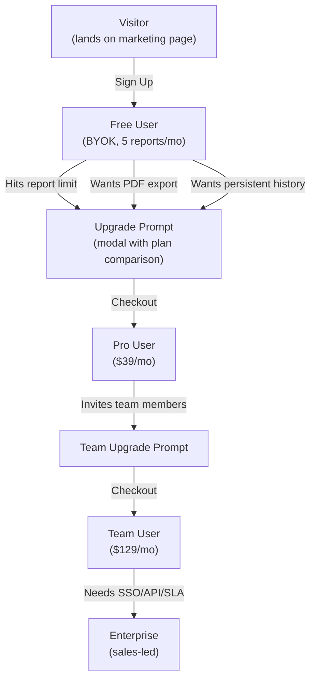
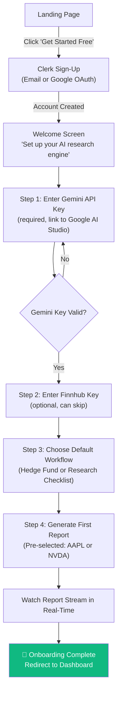
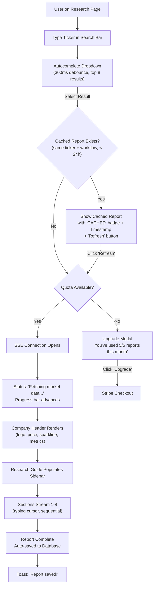
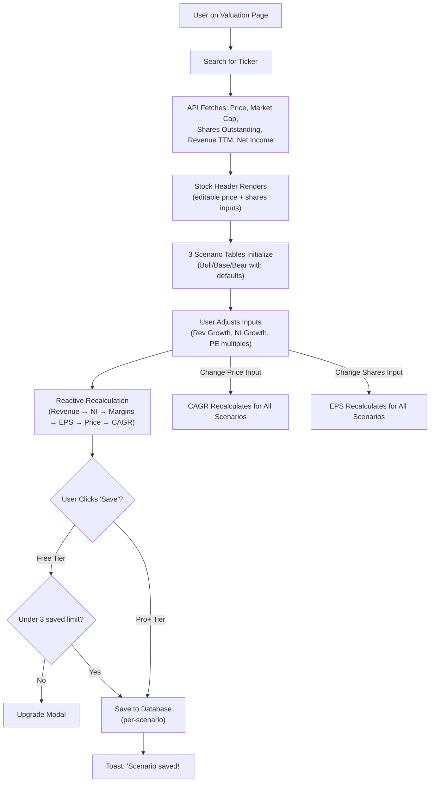
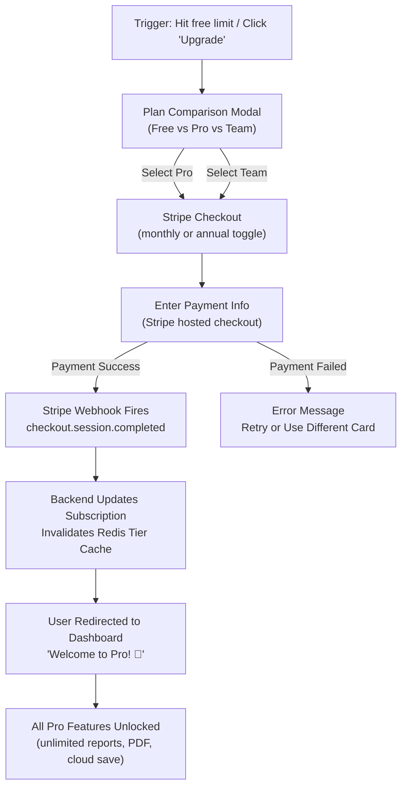

# ApexAlpha AI — Product Requirements Document (PRD)

> **Version**: 1.0.0 | **Date**: 2026-06-08 | **Status**: DRAFT — Pending Review  
> **Author**: Product Team  
> **Companion Docs**: [architecture.md](file:///C:/Users/abasy/.gemini/antigravity/brain/6b263141-3f2e-4b27-9b71-87472f1310b8/architecture.md) · [build_plan.md](file:///C:/Users/abasy/.gemini/antigravity/brain/6b263141-3f2e-4b27-9b71-87472f1310b8/build_plan.md)

---

## Table of Contents

1. [Product Vision & Strategy](#1-product-vision--strategy)
2. [User Personas](#2-user-personas)
3. [Pricing & Monetization](#3-pricing--monetization)
4. [Feature Requirements (MoSCoW)](#4-feature-requirements-moscow)
5. [User Flows](#5-user-flows)
6. [Non-Functional Requirements](#6-non-functional-requirements)
7. [Analytics & Metrics](#7-analytics--metrics)
8. [Legal & Compliance](#8-legal--compliance)
9. [Launch Strategy](#9-launch-strategy)
10. [Risks & Mitigations](#10-risks--mitigations)
11. [Appendix](#11-appendix)

---

## 1. Product Vision & Strategy

### 1.1 Vision Statement

> **Democratize institutional-grade investment research so every investor — from the self-directed retail trader to the boutique fund analyst — can make decisions with the same depth and rigor as a top-tier hedge fund.**

### 1.2 Mission

To build the most powerful AI-driven equity research platform that generates hedge-fund-quality analysis in minutes instead of days, at a fraction of the cost of traditional research tools.

### 1.3 Product Positioning

ApexAlpha AI sits at the intersection of **AI-powered analysis** and **institutional research methodology**. Unlike generic financial dashboards that show data, or chatbots that give vague answers, ApexAlpha produces **structured, opinionated investment memos** following proven frameworks used by the world's best investors.

**One-liner**: *"Your AI equity research analyst — institutional-grade memos and valuation models, delivered in minutes."*

### 1.4 Target Market

| Segment | Size | Description |
|---|---|---|
| **TAM** | $35B | Global financial data & analytics market (2026) |
| **SAM** | $4.2B | AI-powered investment research tools segment |
| **SOM** | $42M | Initial addressable: self-directed investors + small fund analysts in English-speaking markets seeking affordable AI research (est. 100K users × $35/mo ARPU) |

**Primary geographies**: United States, United Kingdom, Canada, Australia, Singapore, Hong Kong.

### 1.5 Competitive Landscape

| Competitor | Price | Strengths | Weaknesses | ApexAlpha Advantage |
|---|---|---|---|---|
| **Bloomberg Terminal** | $24K/yr | Gold standard, comprehensive | Prohibitively expensive, steep learning curve | 100x cheaper, AI-generated memos vs. raw data |
| **Koyfin** | $0-$49/mo | Great visualization, fair price | No AI analysis, no report generation | AI-written reports, not just dashboards |
| **FinChat** | $0-$30/mo | AI chat for financials | Chat format, not structured research | Structured 8-section memos > freeform chat |
| **Simply Wall St** | $0-$20/mo | Beautiful infographics, accessible | Surface-level, no institutional depth | Hedge-fund-level depth, valuation modeling |
| **Tegus** | $15K+/yr | Expert transcripts, deep research | Enterprise-only pricing | Same depth at 1% of the cost |
| **AlphaSense** | $10K+/yr | NLP search across filings | Search tool, not report generator | Generates complete reports, not search results |
| **ChatGPT/Claude** | $20/mo | General AI, flexible | No financial data integration, generic prompts, no structured output | Purpose-built prompts, real-time data, structured memos |

### 1.6 Unique Value Proposition

1. **Structured, not generic**: 8-section investment memos following proven hedge fund frameworks — not freeform AI chat.
2. **Real data, not hallucinations**: Every report is seeded with live market data from Finnhub + yfinance before AI generation.
3. **Dual workflow**: Hedge Fund mode for conviction-driven analysis, Research Checklist mode for systematic due diligence.
4. **Built-in valuation**: Interactive 5-year Bull/Base/Bear scenario modeler with live CAGR calculations — not just a memo.
5. **Streaming experience**: Reports generate section-by-section in real-time with a typing cursor — feels like watching an analyst write.

### 1.7 North Star Metric

> **Reports Generated Per Week (RGPW)**

This metric captures:
- User activation (users must set up keys and search to generate)
- Engagement (returning users generate more reports)
- Value delivery (each report = value delivered)
- Monetization signal (free tier limit = conversion driver)

**Targets**:
| Milestone | RGPW | When |
|---|---|---|
| Beta launch | 100 | Week 16 |
| 3 months post-launch | 1,000 | Month 7 |
| 6 months post-launch | 5,000 | Month 10 |
| 12 months post-launch | 20,000 | Month 16 |

---

## 2. User Personas

### 2.1 Marcus — The Self-Directed Retail Investor

| Field | Detail |
|---|---|
| **Age** | 34 |
| **Role** | Software Engineer (invests personal portfolio) |
| **Portfolio** | $180K across 15-20 individual stocks |
| **Experience** | 5 years of investing, reads 10-Ks but not systematically |
| **Tools Today** | Yahoo Finance, Reddit r/investing, occasional Seeking Alpha, ChatGPT |
| **Goals** | Make informed buy/sell decisions with institutional-level research. Build conviction before sizing positions. |
| **Pain Points** | (1) Spends 3-4 hours researching a single stock manually. (2) Can't tell if his analysis is missing something critical. (3) ChatGPT gives generic analysis without real-time financial data. (4) Can't afford Bloomberg or Tegus. |
| **How ApexAlpha Helps** | Generates a complete hedge fund memo in 3 minutes with live data. The structured 8-section format ensures he never misses management quality, competitive position, or financial red flags. Research Checklist mode gives him a systematic process. |
| **Tier** | **Free → Pro** (converts when he hits 5 report limit and wants to save reports) |

### 2.2 Sarah — The Small Fund Analyst

| Field | Detail |
|---|---|
| **Age** | 28 |
| **Role** | Junior Equity Analyst at a $200M long/short fund (3-person investment team) |
| **Experience** | 3 years post-MBA, covers 40 names across tech and healthcare |
| **Tools Today** | Bloomberg Terminal (firm account), FactSet, internal models in Excel |
| **Goals** | Accelerate initial screening of new ideas. Draft preliminary memos faster so she can spend more time on primary research (expert calls, channel checks). |
| **Pain Points** | (1) Takes 2 days to write a first-pass memo on a new name. (2) PM expects quick turnaround on "what do you think of X?" requests. (3) Bloomberg has the data but doesn't write the analysis. (4) Existing AI tools aren't structured enough for institutional presentation. |
| **How ApexAlpha Helps** | Generates a first-draft institutional memo in minutes that she can refine and present. The Hedge Fund workflow matches her firm's internal memo format. Valuation calculator replaces her Excel model for quick-and-dirty 5-year scenarios. |
| **Tier** | **Team** (shared workspace with PM and co-analyst) |

### 2.3 David — The Financial Advisor / RIA

| Field | Detail |
|---|---|
| **Age** | 52 |
| **Role** | Independent Registered Investment Advisor, manages $45M AUM across 80 client accounts |
| **Experience** | 25 years in financial services, CFP designation |
| **Tools Today** | Morningstar, Schwab Research, occasional FactSet, Excel |
| **Goals** | Provide clients with professional-looking research justification for portfolio recommendations. Show clients he's doing deep work. |
| **Pain Points** | (1) Clients increasingly ask "why this stock?" and expect detailed reasoning. (2) Doesn't have time to write custom research reports for each recommendation. (3) Morningstar reports are generic and the same for every advisor. (4) Needs something branded/professional to share with clients. |
| **How ApexAlpha Helps** | Generates institutional-quality memos he can share with clients as PDF exports. The Research Checklist mode provides systematic due diligence documentation. Valuation models give clients concrete price targets with assumptions they can discuss. |
| **Tier** | **Pro** (PDF export is the key conversion feature) |

### 2.4 Jennifer — The Investment Club Leader

| Field | Detail |
|---|---|
| **Age** | 41 |
| **Role** | VP of Marketing by day, runs a 12-person investment club that meets monthly |
| **Experience** | 10 years investing, informally teaches club members |
| **Tools Today** | Google Sheets, Investopedia, club members share articles in a WhatsApp group |
| **Goals** | Standardize how club members pitch stock ideas. Create a shared research library. Give members a framework for analysis instead of "I saw it on TikTok." |
| **Pain Points** | (1) Members present ideas with wildly varying quality — some have deep analysis, others just have a gut feeling. (2) No shared repository of past research. (3) New members don't know how to analyze a stock. (4) Can't afford institutional tools for a hobby club. |
| **How ApexAlpha Helps** | Team workspace where all members generate reports using the same structured framework. Shared report library becomes the club's knowledge base. The Research Checklist mode teaches new members what to look for. Valuation calculator standardizes how they model upside/downside. |
| **Tier** | **Team** (12 members, shared workspace, viewer roles for newer members) |

---

## 3. Pricing & Monetization

### 3.1 Pricing Philosophy

- **Free tier must be genuinely useful** — not a crippled trial. Users should experience the full quality of AI reports.
- **Conversion trigger is volume and persistence** — free users convert when they want to save more reports and generate more than 5/month.
- **BYOK on Free keeps costs zero** — users bring their own Gemini key, so free tier costs us only infrastructure (minimal).
- **Pro justifies itself with a single report** — a professional analyst's time is worth $50+/hr. One report saves 2+ hours.

### 3.2 Tier Structure

| Feature | Free | Pro | Team | Enterprise |
|---|---|---|---|---|
| **Price** | $0 | $39/mo ($390/yr) | $129/mo ($1,290/yr) | Custom |
| **Reports / month** | 5 | Unlimited | Unlimited | Unlimited |
| **Valuations saved** | 3 | Unlimited | Unlimited | Unlimited |
| **Workflows** | Both (HF + RC) | Both | Both | Both + Custom |
| **AI Provider** | BYOK only | Managed + BYOK | Managed + BYOK | Managed + BYOK |
| **Report Persistence** | 7 days | Unlimited | Unlimited | Unlimited |
| **PDF Export** | ❌ | ✅ | ✅ | ✅ |
| **Report Sharing (link)** | ❌ | ✅ | ✅ | ✅ |
| **Cloud Save (valuations)** | ❌ | ✅ | ✅ | ✅ |
| **Team Workspace** | ❌ | ❌ | ✅ (up to 10 members) | ✅ (unlimited) |
| **Shared Reports** | ❌ | ❌ | ✅ | ✅ |
| **RBAC** | ❌ | ❌ | ✅ | ✅ |
| **Priority Generation** | ❌ | ✅ (dedicated queue) | ✅ | ✅ |
| **API Access** | ❌ | ❌ | ❌ | ✅ |
| **SSO** | ❌ | ❌ | ❌ | ✅ |
| **Custom Models** | ❌ | ❌ | ❌ | ✅ |
| **SLA** | None | None | 99.9% | 99.95% |
| **Support** | Community | Email (48h) | Email (24h) | Dedicated (4h) |

### 3.3 Revenue Model

```
Free users (BYOK) → $0 cost, $0 revenue (acquisition funnel)
Pro users → $39/mo revenue, ~$3/mo Gemini API cost per user ≈ $36/mo net
Team users → $129/mo revenue, ~$15/mo Gemini API cost ≈ $114/mo net
```

**Unit economics target**: >85% gross margin on Pro, >88% on Team.

### 3.4 Annual Discount

| Tier | Monthly | Annual | Savings |
|---|---|---|---|
| Pro | $39/mo | $390/yr ($32.50/mo) | 17% |
| Team | $129/mo | $1,290/yr ($107.50/mo) | 17% |

### 3.5 Conversion Funnel



---

## 4. Feature Requirements (MoSCoW)

### 4.1 Must Have — MVP (Launch)

These features are required for the initial public launch.

| # | Feature | Description | Persona | Acceptance Criteria |
|---|---|---|---|---|
| M1 | **User Registration & Login** | Email + password and Google OAuth sign-up/sign-in via Clerk. Password reset. Email verification. | All | User can create account and log in within 30 seconds |
| M2 | **Hedge Fund Report Generation** | 8-section investment memo generated via Gemini, streamed in real-time via SSE with typing cursor animation. Identical to current functionality. | All | All 8 sections stream successfully for any valid US stock ticker |
| M3 | **Research Checklist Generation** | 8-step due diligence checklist (Jeremy's framework), streamed via SSE. Identical to current functionality. | Marcus, Sarah | All 8 steps stream successfully with systematic structure |
| M4 | **Research Guide Sidebar** | Auto-generated "What Really Matters", "How To Research", "Key KPIs" panel for each company analyzed. | All | Sidebar populates with relevant, company-specific guidance |
| M5 | **Per-User API Key Management** | Settings page to configure Gemini (required) and Finnhub (optional) API keys. Keys encrypted with AES-256-GCM at rest. Status indicators (green/red dots). | All | Keys stored encrypted, survive logout/login, not accessible by other users |
| M6 | **Report Persistence** | Generated reports saved to database with all sections. Report list page shows history. View any past report. Delete reports. | All | Report retrievable after browser close, page refresh, and re-login |
| M7 | **Valuation Calculator** | 5-year Bull/Base/Bear projection model with reactive inputs. Revenue, Net Income, EPS, Share Price, CAGR calculations. Live seed data from API. | Marcus, Sarah | Calculations match current `calcProjections` logic exactly |
| M8 | **Dashboard** | Home page showing: recent reports (last 10), saved valuations, usage meter (reports this month / limit), quick-action buttons. | All | Dashboard loads in < 2 seconds, shows accurate usage count |
| M9 | **Ticker Search** | Autocomplete search with debounce (300ms). Shows ticker symbol + company name. Available on all pages. | All | Returns results for major US stocks within 500ms |
| M10 | **Financial Data Display** | Company header (logo, name, sector, price, change), 8-metric grid (Market Cap, Revenue, FCF, P/E, EV/Rev, Gross Margin, Op Margin, Rev Growth), sparkline chart, news feed (top 4). | All | Data matches live Finnhub/yfinance within 5-minute staleness |
| M11 | **Free Tier Limits** | 5 reports/month, 3 saved valuations, 7-day report retention, BYOK only. Clear upgrade prompts when limits reached. | Marcus | User sees remaining quota; receives friendly upgrade modal at limit |
| M12 | **Stripe Billing** | Checkout flow for Pro and Team plans. Self-service subscription management via Stripe portal. Webhook-driven tier updates. | Pro, Team | Subscription activates within 30 seconds of payment |
| M13 | **Responsive Design** | Full functionality at breakpoints: 1600+, 1200, 900, 699, 479px. Mobile sidebar as drawer. Touch-friendly inputs. | All | Usable on iPhone 14 (390px) without horizontal scroll |
| M14 | **Dark Glassmorphism Theme** | Preserve the current premium dark theme exactly: `--bg: #0d1117`, `--accent: #3b82f6`, Inter + JetBrains Mono fonts, backdrop-filter blur, gradient cards. | All | No visual regression from current design |

### 4.2 Should Have — V1.1 (1-2 Months Post-Launch)

| # | Feature | Description | Persona |
|---|---|---|---|
| S1 | **PDF Export** | Download any saved report as a professionally formatted PDF. Company header, sections, financial metrics. Branded with ApexAlpha watermark (free) or clean (Pro+). | David, Sarah |
| S2 | **Report Sharing via Link** | Generate a shareable URL for any report. Public (no login) or team-only. Optionally set expiry date. | Sarah, David |
| S3 | **Watchlist** | Save tickers to a personal watchlist. Quick access from dashboard. See last analyzed date and basic quote data. | Marcus |
| S4 | **Email Notifications** | "Your report is ready" email when async generation completes. Monthly usage summary. Approaching limit warnings. | All |
| S5 | **Dark / Light Mode Toggle** | Light mode alternative for daytime use. Preserve glassmorphism aesthetic in light variant. User preference persisted. | David |
| S6 | **Search History** | Last 20 searches remembered and shown as suggestions. Per-user, persisted server-side. | All |
| S7 | **Keyboard Shortcuts** | `/` to focus search, `Esc` to close modals, `1-8` to jump to report section, `Cmd+S` to save valuation. | Sarah |
| S8 | **Comparison Mode** | Side-by-side view of two reports for the same or different tickers. Synchronized scrolling. | Sarah |
| S9 | **Valuation Cloud Save** | Save/load valuation scenarios to server (replace localStorage). List of saved valuations accessible from any device. | Marcus, Sarah |
| S10 | **Import from localStorage** | One-click migration of existing local reports and valuations to cloud account on first login. | Marcus |

### 4.3 Could Have — V1.2+ (3-6 Months Post-Launch)

| # | Feature | Description | Persona |
|---|---|---|---|
| C1 | **Team Workspaces** | Organization accounts with shared report library, member management, and role-based access. | Jennifer, Sarah |
| C2 | **Comments & Annotations** | Add notes to specific report sections. Team members can discuss findings inline. | Sarah, Jennifer |
| C3 | **Custom Report Templates** | Define custom section orders, prompts, and personas. Save as reusable templates. | Sarah |
| C4 | **Portfolio Analysis** | Upload a portfolio (CSV) and generate aggregate analysis across holdings. Sector allocation, concentration risk. | David |
| C5 | **Scheduled Reports** | Set up recurring weekly/monthly reports for watched tickers. Auto-generated and emailed. | David, Marcus |
| C6 | **API Access** | RESTful API for programmatic report generation. Webhook delivery of completed reports. | Sarah (Enterprise) |
| C7 | **PWA / Mobile** | Progressive Web App with offline caching of recent reports. Install to home screen. Push notifications. | Marcus |
| C8 | **Model Selection** | Choose between Gemini 2.5 Flash (fast), Gemini 2.5 Pro (deeper), GPT-4o, Claude (with user's own keys). | Sarah |
| C9 | **Slack/Discord Integration** | Share reports to Slack channels. Generate reports from slash commands. | Jennifer |
| C10 | **International Markets** | Support for non-US tickers (LSE, TSE, HKEX, etc.). Currency conversion. Localized financial terms. | All |

### 4.4 Won't Have — Out of Scope

| Feature | Reason |
|---|---|
| Real-time trading execution | Regulatory complexity, not core value proposition |
| Portfolio management / tracking | Overlaps with existing tools (Personal Capital, Wealthfront). Our value is research, not tracking. |
| Social features / public profiles | Focus on individual and team utility, not social networking |
| Crypto / forex analysis | Different data sources, different analysis frameworks, dilutes focus |
| Custom data source integrations | Premature complexity. Revisit for Enterprise tier. |
| News aggregation platform | We surface relevant news within reports. Not building a news reader. |

---

## 5. User Flows

### 5.1 New User Onboarding



**Success metric**: ≥70% of signups complete onboarding within first session.

### 5.2 Report Generation Flow



### 5.3 Valuation Workflow



### 5.4 Subscription Upgrade Flow



### 5.5 Cached vs. Fresh Report

| Scenario | Behavior |
|---|---|
| **No cache exists** | Full SSE generation (data fetch → research guide → 8 sections) |
| **Cache < 24h, same workflow** | Instant render from cache. "CACHED" badge shown with timestamp. "Refresh" button available. |
| **Cache < 24h, different workflow** | Cache miss — generate fresh (cache keys include workflow type) |
| **Cache > 24h** | Cache expired — generate fresh |
| **User clicks "Refresh"** | Force re-generation, bypasses cache, replaces existing cache entry |

---

## 6. Non-Functional Requirements

### 6.1 Performance

| Metric | Target | Measurement |
|---|---|---|
| **Page Load (LCP)** | < 2.0s | Lighthouse on dashboard page |
| **First Input Delay** | < 100ms | Lighthouse |
| **Search Response** | < 500ms (p95) | CloudWatch API metrics |
| **Report Generation** | < 90s total, first section < 15s | CloudWatch SSE metrics |
| **Valuation Data Load** | < 3s | CloudWatch API metrics |
| **Cached Report Load** | < 500ms | Redis cache hit time |
| **API Response (non-SSE)** | < 300ms (p95) | CloudWatch API metrics |

### 6.2 Availability & Reliability

| Metric | Target |
|---|---|
| **Uptime SLA** | 99.9% (8.76h downtime/year max) |
| **RTO (Recovery Time Objective)** | 30 minutes |
| **RPO (Recovery Point Objective)** | 5 minutes (database) |
| **SSE Connection Stability** | < 1% drop rate during generation |
| **Scheduled Maintenance Window** | Tuesday 3-5am UTC (announced 48h prior) |

### 6.3 Scalability

| Dimension | Launch Target | 6-Month Target | 12-Month Target |
|---|---|---|---|
| **Concurrent Users** | 100 | 1,000 | 10,000 |
| **Concurrent SSE Streams** | 20 | 200 | 2,000 |
| **Reports/Day** | 200 | 2,000 | 20,000 |
| **Database Size** | 5 GB | 50 GB | 500 GB |
| **ECS Tasks** | 2 | 5-10 | 20-50 |

### 6.4 Security

| Requirement | Implementation |
|---|---|
| **Encryption in Transit** | TLS 1.3, HSTS, A+ SSL Labs rating |
| **Encryption at Rest** | RDS: AES-256, S3: SSE-S3, API keys: AES-256-GCM |
| **Authentication** | Clerk with JWT, OAuth2, optional MFA |
| **Authorization** | Role-based (owner/admin/analyst/viewer) |
| **CORS** | Locked to production domains only |
| **Rate Limiting** | Per-user sliding window, per-IP burst protection |
| **Input Validation** | Pydantic schemas, ticker regex: `^[A-Z0-9.\-]+$` |
| **Dependency Scanning** | Automated via Snyk/Trivy in CI |
| **SOC 2 Readiness** | Audit trail, access controls, encryption, change management |

### 6.5 Accessibility

| Standard | Target |
|---|---|
| **WCAG Level** | 2.1 AA |
| **Keyboard Navigation** | All interactive elements focusable and operable |
| **Screen Reader** | ARIA labels on all controls, semantic HTML |
| **Color Contrast** | ≥ 4.5:1 for normal text, ≥ 3:1 for large text |
| **Motion** | Respect `prefers-reduced-motion` for animations |

### 6.6 Browser Support

| Browser | Minimum Version |
|---|---|
| Chrome | Last 2 major versions |
| Firefox | Last 2 major versions |
| Safari | Last 2 major versions |
| Edge | Last 2 major versions |
| Mobile Safari (iOS) | iOS 16+ |
| Chrome for Android | Last 2 major versions |

### 6.7 Data Retention

| Data Type | Free Tier | Pro/Team | After Cancellation |
|---|---|---|---|
| **Reports** | 7 days | Unlimited (while subscribed) | 30 days, then deleted |
| **Valuations** | 3 active | Unlimited | 30 days |
| **Usage Logs** | 90 days | 1 year | Anonymized after 90 days |
| **Account Data** | Indefinite | Indefinite | Deleted on request (GDPR) |
| **API Keys** | While active | While active | Deleted immediately on cancellation |

---

## 7. Analytics & Metrics

### 7.1 Key Metrics Dashboard

| Category | Metric | Definition | Target (Month 6) |
|---|---|---|---|
| **Acquisition** | Signups/week | New accounts created | 200 |
| **Activation** | Onboarding completion rate | % of signups who generate first report | ≥ 70% |
| **Engagement** | DAU/MAU ratio | Daily active / Monthly active users | ≥ 25% |
| **Engagement** | Reports generated/week (RGPW) | Total reports across all users | 5,000 |
| **Engagement** | Avg. reports per active user/week | Reports / WAU | 3 |
| **Retention** | Week 1 retention | % returning within 7 days of signup | ≥ 40% |
| **Retention** | Month 1 retention | % active 30 days after signup | ≥ 30% |
| **Revenue** | MRR | Monthly Recurring Revenue | $15,000 |
| **Revenue** | ARPU | Average Revenue Per User (paid only) | $45 |
| **Conversion** | Free → Pro conversion rate | % of free users who upgrade | ≥ 5% |
| **Churn** | Monthly churn rate | % of paid users who cancel | ≤ 5% |
| **Satisfaction** | NPS | Net Promoter Score (quarterly survey) | ≥ 40 |

### 7.2 Analytics Implementation

| Tool | Purpose |
|---|---|
| **PostHog** (or Mixpanel) | Product analytics: events, funnels, retention, feature flags |
| **Stripe Dashboard** | Revenue metrics, subscription analytics, churn analysis |
| **Sentry** | Error tracking, performance monitoring |
| **CloudWatch** | Infrastructure metrics, API latency, SSE connection health |
| **Google Search Console** | SEO performance for landing/marketing pages |

### 7.3 Key Events to Track

| Event | Properties | When |
|---|---|---|
| `user.signed_up` | method (email/google), referrer | Account creation |
| `onboarding.step_completed` | step_number, step_name | Each onboarding step |
| `onboarding.completed` | duration_seconds | Final step |
| `report.generation_started` | ticker, workflow | SSE connection opens |
| `report.generation_completed` | ticker, workflow, duration_seconds | Complete event received |
| `report.viewed` | report_id, source (dashboard/search/link) | Report opened |
| `report.deleted` | report_id | Report deleted |
| `valuation.created` | ticker | New valuation created |
| `valuation.scenario_saved` | ticker, scenario | Scenario saved |
| `search.performed` | query, results_count | Search executed |
| `upgrade.prompt_shown` | trigger (limit/feature), current_tier | Modal displayed |
| `upgrade.checkout_started` | target_tier, billing_cycle | Checkout initiated |
| `upgrade.completed` | tier, billing_cycle, revenue | Subscription activated |
| `feature.used` | feature_name (pdf_export, share_link, etc.) | Feature interaction |

### 7.4 A/B Testing Roadmap

| Test | Hypothesis | Metric | Timeline |
|---|---|---|---|
| Free tier limit (5 vs. 3 reports) | Lower limit → higher conversion rate | Free → Pro conversion | Month 2 |
| Onboarding length (4 steps vs. 2 steps) | Shorter onboarding → higher completion | Onboarding completion rate | Month 2 |
| Pricing ($29 vs. $39 vs. $49 for Pro) | Price sensitivity testing | Revenue per signup | Month 3 |
| Upgrade prompt timing (at limit vs. after 3rd report) | Earlier nudge → higher conversion | Conversion rate | Month 3 |
| Landing page hero (demo video vs. static image) | Video → higher signup rate | Visitor → Signup rate | Month 4 |

---

## 8. Legal & Compliance

### 8.1 Required Legal Pages

| Document | Status | Requirements |
|---|---|---|
| **Terms of Service** | Required for launch | Acceptable use, disclaimer of financial advice, limitation of liability, data ownership, termination policy |
| **Privacy Policy** | Required for launch | Data collection, usage, sharing, retention, rights (GDPR/CCPA). Must list Clerk, Stripe, Gemini, Finnhub as sub-processors |
| **Cookie Policy** | Required for launch | Session cookies, analytics cookies. Cookie consent banner for EU users |
| **Financial Disclaimer** | Required for launch | Prominent: "Not financial advice. Projections are hypothetical. Not a registered investment advisor." Must appear on every report and on landing page |

### 8.2 GDPR Compliance

| Requirement | Implementation |
|---|---|
| **Right to Access** | User can export all data via Settings |
| **Right to Deletion** | Account deletion removes all PII within 30 days |
| **Data Portability** | Export reports as JSON/PDF |
| **Consent** | Cookie consent banner, clear privacy policy |
| **Data Processing Agreement** | Needed with Clerk, Stripe, AWS |
| **Data Residency** | Initial: US region. EU region available for Enterprise |

### 8.3 CCPA Compliance

| Requirement | Implementation |
|---|---|
| **Right to Know** | Privacy policy details all data collected |
| **Right to Delete** | Account deletion workflow |
| **Right to Opt-Out** | No data selling; analytics opt-out in settings |
| **Non-Discrimination** | No service degradation for exercising rights |

### 8.4 Financial Regulatory Considerations

> [!CAUTION]
> ApexAlpha AI is positioned as an **educational research tool**, NOT as a registered investment advisor. All reports must include the disclaimer: *"This analysis is generated by AI for educational purposes only. It does not constitute financial advice, a recommendation, or a solicitation to buy or sell any security."*

- **Not providing personalized advice**: Reports are generated for any ticker on-demand, not tailored to individual financial situations.
- **Not managing assets**: No portfolio management, no trade execution.
- **Disclaimers**: Visible on every generated report, landing page footer, and Terms of Service.
- **Legal review recommended** before launch to confirm compliance with SEC guidance on AI-generated research.

---

## 9. Launch Strategy

### 9.1 Launch Phases

| Phase | Duration | Audience | Goal |
|---|---|---|---|
| **Alpha** (Internal) | 2 weeks | Team + 5 trusted testers | Identify critical bugs, validate core flows |
| **Closed Beta** | 2 weeks | 50 invited users (mix of personas) | Gather UX feedback, validate pricing, test billing |
| **Open Beta** | 2 weeks | Public signup, "Beta" badge on site | Scale testing, marketing validation, press outreach |
| **General Availability** | — | Full public launch | Revenue generation, growth focus |

### 9.2 Beta User Recruitment

| Source | Target | Method |
|---|---|---|
| **Twitter/X FinTwit** | 20 users | Post demo video, invite replies to DM |
| **Reddit r/investing, r/stocks** | 10 users | "We built an AI analyst" post with beta invite |
| **LinkedIn** | 10 users | Personal outreach to fund analysts, RIAs |
| **Investment clubs** | 5-10 users | Contact local Meetup investment groups |
| **Product Hunt** | Pre-launch page | Save for GA launch |

### 9.3 Marketing Channels (Post-Launch)

| Channel | Budget | Expected CAC | Strategy |
|---|---|---|---|
| **Content / SEO** | $0 (time) | $5 | Blog: "How to analyze X like a hedge fund", "AI vs. traditional research" |
| **Twitter/X** | $0 (time) | $3 | Daily stock analysis threads using ApexAlpha, share screenshots |
| **YouTube** | $0 (time) | $8 | Screen recordings of live report generation |
| **Google Ads** | $2K/mo | $25 | Target: "stock analysis tool", "investment research AI" |
| **Product Hunt** | $0 | $10 | GA launch day — aim for top 5 |
| **Reddit** | $0 (time) | $5 | Value-first posts in investing subreddits |
| **Referral Program** | $0 (Pro credits) | $15 | "Give a friend 1 month Pro, get 1 month free" |

### 9.4 Launch Success Criteria (First 30 Days)

| Metric | Target |
|---|---|
| Signups | ≥ 500 |
| Onboarding completion | ≥ 70% |
| Reports generated | ≥ 2,000 |
| Paid conversions | ≥ 25 (5%) |
| MRR | ≥ $1,000 |
| Critical bugs reported | 0 unresolved |
| NPS (beta survey) | ≥ 35 |
| Uptime | ≥ 99.9% |

---

## 10. Risks & Mitigations

### 10.1 Technical Risks

| Risk | Likelihood | Impact | Mitigation |
|---|---|---|---|
| **Gemini API outage** | Medium | High | Fallback to OpenAI/Claude with user's BYOK. Queue reports for retry. |
| **yfinance reliability** | High | Medium | Finnhub as primary data source. Circuit breaker pattern. Consider paid Yahoo Finance API. |
| **SSE connection drops** | Medium | Medium | Resume tokens in SSE events. Client-side reconnection with `Last-Event-ID`. |
| **Database scaling** | Low | High | Start with RDS `db.t3.medium`, monitor query performance, add read replicas when needed. |
| **AI hallucination in reports** | Medium | High | Seed every prompt with real financial data. Include disclaimer. Log prompts for audit. |

### 10.2 Market Risks

| Risk | Likelihood | Impact | Mitigation |
|---|---|---|---|
| **Large competitor enters space** | Medium | High | Move fast, build community, own the "structured memo" niche. Competitors will do general AI chat. |
| **Users prefer free ChatGPT** | Medium | Medium | Emphasize: real-time data integration, structured output, persistence, valuation tools. ChatGPT can't do this. |
| **Low willingness to pay** | Medium | High | Validate pricing in beta. A/B test. Consider lower Pro price ($19-29). |
| **Market downturn reduces investor activity** | Low | Medium | Position as essential tool for bear markets too ("know what you own"). |

### 10.3 Regulatory Risks

| Risk | Likelihood | Impact | Mitigation |
|---|---|---|---|
| **SEC scrutiny of AI investment advice** | Low | Critical | Strong disclaimers. "Educational tool" positioning. No personalized advice. Legal review. |
| **Data source TOS violations** | Medium | High | Review yfinance and Finnhub TOS. Ensure compliance with redistribution terms. |
| **GDPR enforcement** | Low | Medium | Privacy-by-design. DPA with sub-processors. Right to deletion implemented. |

### 10.4 Dependency Risks

| Dependency | Risk | Mitigation |
|---|---|---|
| **Google Gemini** | Pricing changes, rate limits, model deprecation | Support multiple LLM providers. BYOK model. |
| **Finnhub** | API changes, pricing, rate limits | yfinance as fallback. Abstract data layer. |
| **yfinance** | Unofficial scraper, could break anytime | Finnhub as primary. Monitor yfinance health. |
| **Clerk** | Vendor lock-in, pricing changes | Standard JWT — migration to Auth0 or self-hosted viable. |
| **Stripe** | Low risk (industry standard) | Standard integration. No custom Stripe features. |

---

## 11. Appendix

### 11.1 Glossary

| Term | Definition |
|---|---|
| **ADR** | Average Daily Bed Rate (Fosun/Club Med metric, per user rules context) |
| **ARPU** | Average Revenue Per User |
| **BYOK** | Bring Your Own Key — users provide their own API keys |
| **CAGR** | Compound Annual Growth Rate |
| **CAC** | Customer Acquisition Cost |
| **DAU/MAU** | Daily/Monthly Active Users |
| **EPS** | Earnings Per Share |
| **HF Mode** | Hedge Fund workflow (8-section investment memo) |
| **LTV** | Lifetime Value (of a customer) |
| **MRR** | Monthly Recurring Revenue |
| **NPS** | Net Promoter Score |
| **P/E** | Price-to-Earnings ratio |
| **RC Mode** | Research Checklist workflow (8-step due diligence) |
| **RGPW** | Reports Generated Per Week (North Star metric) |
| **SSE** | Server-Sent Events |
| **TAM** | Total Addressable Market |
| **TTM** | Trailing Twelve Months |

### 11.2 Reference Documents

| Document | Location |
|---|---|
| Architecture Document | [architecture.md](file:///C:/Users/abasy/.gemini/antigravity/brain/6b263141-3f2e-4b27-9b71-87472f1310b8/architecture.md) |
| Build Plan | [build_plan.md](file:///C:/Users/abasy/.gemini/antigravity/brain/6b263141-3f2e-4b27-9b71-87472f1310b8/build_plan.md) |
| Current Codebase | [hedge-fund-analysis](file:///d:/repos/hedge-fund-analysis) |
| Current README | [README.md](file:///d:/repos/hedge-fund-analysis/README.md) |

### 11.3 Revision History

| Version | Date | Author | Changes |
|---|---|---|---|
| 1.0.0 | 2026-06-08 | Product Team | Initial draft |
